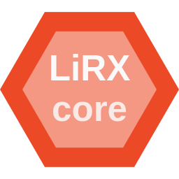
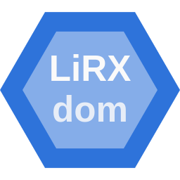
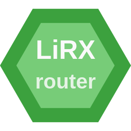
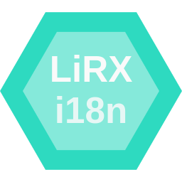
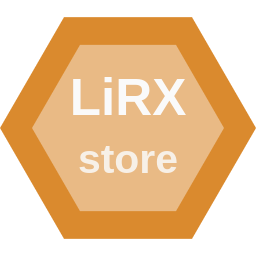

<h1 align="center">LiRX/core - The fastest Reactive Programming framework</h1>

<p align="center">
  <a href="https://core.lirx.org/">
    
  </a>
  <br>
  <i><strong>@lirx/core</strong> is an extremely performant framework to master asynchronous data streams using Observables, Observers, and Signals.</i>
</p>

<p align="center">
  <a href="https://core.lirx.org/">
    DOCUMENTATION
  </a>
</p>

<p align="center">
  <a href="https://www.npmjs.com/package/@lirx/core">
    
  </a>
  
  
  
</p>

<hr>

`@lirx/core` (pronounced `lyrics`) is simply the [fastest and smallest](https://core.lirx.org/docs/documentation/performances/introdution/) javascript library for `Reactive Programming`,
providing different tools to generate, consume, and pipe Observables and Observers.
It even provides powerful tools like [Signals](https://core.lirx.org/docs/documentation/signals/introduction/) out-of-the-box.

If *Reactive Programming* does not tell you much or is a new concept to you, you may [take a look at this tutorial](https://core.lirx.org/docs/documentation/getting-started/introduction/).
In a few words, if you deal frequently with async programming like *events*, *timeouts*, *promises* or *streams* (ex: front-end development),
then `@lirx/core` is the perfect candidate for you.


*Example: emulate double click*

```ts
const subscribe = pipe$$(fromEventTarget(window, 'click'), [
  bufferTime$$$(500),
  filter$$$((events: PointerEvent[]) => events.length === 2),
  map$$$((events: PointerEvent[]) => events[events.length - 1]),
]);

subscribe((event: PointerEvent) => {
  console.log('double click', event);
});
```

[//]: # (TODO)
[//]: # ([Click here to see the live demo]&#40;https://stackblitz.com/edit/typescript-sfkssg?devtoolsheight=33&file=index.ts&#41;)

*Example: signals !*

```ts
const counter = signal(0);
const isEven = computed(() => counter() % 2 === 0);
const color = computed(() => (isEven() ? 'red' : 'blue'));

effect(() => {
  console.log('counter', counter(), 'isEven', isEven(), 'color', color());
});

fromEventTarget(window, 'click')(() => {
  counter.update((currentValue) => currentValue + 1);
});
```

[//]: # (TODO demo)

Give it a try, and you'll love it !


## 📕 Documentation

You may find the documentation of `@lirx/core` on the official website: [https://core.lirx.org](https://core.lirx.org/),
with a gentle [introduction here](https://core.lirx.org/docs/documentation/getting-started/introduction/)
and the [reference page here](https://core.lirx.org/docs/reference/any-with-notifications/).

Here are the essential links:

- [Signal](https://core.lirx.org/docs/documentation/signals/introduction/)
- [Observable](https://core.lirx.org/docs/reference/observable/)
- [Observer](https://core.lirx.org/docs/reference/observer/)
- [ObservablePipe](https://core.lirx.org/docs/reference/observable-pipe/) (ak: Pipeable Operator)
- [pipeObservable](https://core.lirx.org/docs/reference/pipe-observable/) (ak: Observable.pipe)
- [pipeObservablePipes](https://core.lirx.org/docs/reference/pipe-observable-pipes/) (ak: pipe function)
- [Notification](https://core.lirx.org/docs/reference/notification/) (ak: *next*, *complete* and *error*)
- [MulticastSource](https://core.lirx.org/docs/reference/multicast-source/) (ak: Subject)
- [ReplayLastSource](https://core.lirx.org/docs/reference/replay-last-source/) (ak: BehaviorSubject)


## 📦 Installation

```bash
yarn add @lirx/core
# or
npm install @lirx/core --save
```

[Click here to read the installation manual](https://core.lirx.org/docs/documentation/getting-started/installation/)


## Ecosystem

<p>
  <a href="https://github.com/lirx-js/core">
    
  </a>
  <a href="https://github.com/lirx-js/dom">
    
  </a>
  <a href="https://github.com/lirx-js/router">
    
  </a>
  <a href="https://github.com/lirx-js/i18n">
    
  </a>
  <a href="https://github.com/lirx-js/store">
    
  </a>
</p>

## Differences with RxJS:

- no classes: this choice allows blazing fast performances and very small bundle size. Indeed, creating a class with
  the `new` keyword is slow, and method names can't be mangled (minimized), where function calls are really well
  optimized by javascript engines. However, it has a minor cost: chaining operators or method calls are done through
  functions, which is a little less elegant (in terms of code readability).

- no `next`, `complete` and `error`: instead this lib uses [notifications](https://core.lirx.org/docs/reference/notification/).
  In reality, not all *Observables* require to emit a final state. For example, the RxJS `interval`
  never reaches a `complete` state. It just sends numbers. Moreover, some *Observables* may want to emit more
  than this 3 *events*: we may imagine an XHR Observable which emits an `upload-progress` and `download-progress` *events*.

- some concepts / operators / methods may have a different behaviour or name.
  Take care to read the documentation before any hasty use.

