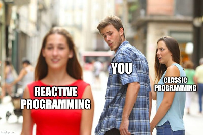
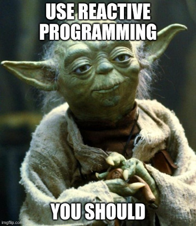

# Why Reactive Programing is so awesome ?

In this post I want to share my personal experience with Reactive Programing and why you should consider using it.

<p align="center">

  

</p>

## The problematic

Let's imagine this simple use case:

> Two &lt;input&gt; in which the user may enter two numbers to perform an addition.
> The result is displayed right below everytime the user type a new value.

[//]: # (TODO video/gif of the example)

**We may:** *implement it from scratch*

Listening to changes in the two &lt;input&gt;, compute the addition, and update the result.
This solution is **performant**.
However, increasing the number of inputs tends to exponentially scale the complexity of the code.
Its usually ends up in **bugs** and nightmares to maintain.

**Or we may:** *use a front-end framework*

Like React with `useState` or Angular with its `ChangeDetector`.
We'll win in **code readability**, at the cost of **performance lost** (when running the change detection algorithm).
Moreover, the app will have a bigger size.

More generally, this problematic is applicable to **every evolving values**, which are nothing more than **streams of data**.

Some examples:

- the current date and time updated every seconds
- a translated text, that changes with the user locale (and maybe some `<select>`)
- the state of a submit button (enabled/disabled), if a form is valid/invalid
- a data stream coming from the backend (ex: live stats)
- and many more...

Handling the refresh, the combination, the transformation, etc. of such streams, is generally complex.
It creates code with low readability, frequent uncovered cases, and inconsistent states.

*What if we could have all benefits: performance, code readability, and consistent states ?*

## The answer

> **Reactive Programing** is the perfect answer to manage streams of data, async flows, and evolving values.

With RP, we build streams of values called **Observables**.
And, we will have an **amazing toolbox** of functions to combine, create and filter any of those streams.
That's where the "functional" magic kicks in. A stream can be used as an input to another one.
Even multiple streams can be used as inputs to another stream.
We can merge two streams. We can filter a stream to get another one that has only those events we are interested in.
We can map data values from one stream to another new one. Etc.

Actually, you're probably already familiar with async data streams: Promises, EventListeners, setInterval, etc.
Reactive programing is all about this but on **steroids**.

> You'll be able to create Observables of anything, not just from click and hover events:
> variables, user inputs, properties, tasks, data structures,...

<p align="center">


</p>

## Reactive Programming by example

You've probably heard of [RxJS](https://rxjs.dev/) which is the most commonly used RP library in javascript.
However, I will promote here **[@lirx/core](https://github.com/lirx-js/core)**,
a library strongly outperforming RxJS in performances, having a better documentation and trying to be simpler.

Ok, let's start:

```ts
const onInput$ = fromEventTarget(input, 'input');
```

It creates an *Observable* for an &lt;input&gt;, listening and emitting Events of type `input`.
It triggers, when the user types something in this input.

> An Observable is simply a source emitting values.

An Observable is not started until we subscribe to it:

```ts
const unsubscribe = onInput$((event) => {
  console.log(event);
});
```

The provided function is called an *Observer*, and it receives the values from our Observable.

> An Observer is a sink receiving values from an Observable

When the user types in the &lt;input&gt;, its value is simply logged in the console.

Subscribing to an Observable returns an `unsubscribe` function.
When called, it notifies the Observable to stop sending more values, and usually free the Observable's resources.

```ts
document.onkeydown = (event) => {
  if (event.key === 'Escape') {
    unsubscribe();
  }
};
```


Here, when pressing the `Escape` key, we terminate our Observable, and stop listening to the `input`'s Events.

At this point, you may notice than subscribing/unsubscribing from streams of data is extremely simple with Observables.
We don't have to keep a reference to the callback function of `.addEventListener` for example.
It's handled by the Observable itself.

So, we have now an Observable sending `input`'s Events, but what if we want the input's value ? It would be more convenient:


```ts
const inputValue$ = map$$(onInput$, () => input.value);
```

The `map$$` function transforms the incoming Events into the input's value. Such a function is called an ObservablePipe.

> An ObservablePipe is a function which transform an Observable to another one

So now, when the user types in the &lt;input&gt;, `inputValue$` emits this input's value instead of an Event.


And this is where Observables shine: we can combine them, transform their values, create complex data flows, etc.
Keeping the complex transformations to `@lirx/core` and focusing only on the interdependence of our data.

---

Let's assemble everything to create a custom function building an Observable from an input's value:

```ts
function fromInput(input: HTMLInputElement): IObservable<string> {
  return merge([
    reference(() => input.value),
    map$$(fromEventTarget(input, 'input'), () => input.value),
  ]);
}
```

Here I have extended a little our first Observable with:

- `reference(() => input.value)`: this creates an Observable which emits the input's value when subscribed.
- `merge`: subscribes to the list of Observables and re-emits all their values.

Here, we will combine `merge` and `reference` because the `input` event is not immediately triggered when we subscribe to our Observable,
so we need another way to retrieve the initial input's value.

In short, subscribing to this Observable sends the initial input's value and next values typed by the user.

And if we want to consume our Observable, we simply write:

```ts
const inputValue$ = fromInput(input);

inputValue$((value) => {
  console.log(value);
});
```

---

Alright, let's finish by solving the initial example:

> Two &lt;input&gt; in which the user may enter two numbers to perform an addition.
> The result is displayed right below everytime the user type a new value.

First we have to convert the input's values to numbers:

```ts
function fromNumberInput(input: HTMLInputElement): IObservable<number> {
  return pipe$$(fromInput(input), [
    map$$$(Number),
    filter$$$(_ => !Number.isNaN(_)),
  ]);
}
```

The `pipe$$` function applies many *ObservablePipes* to an Observable.

We start by applying the `map$$$` ObservablePipe to convert the input's values to numbers.

Then,  through the ObservablePipe `filter$$$`, we filter these numbers to keep only the valid ones.
We have to do it to handle the cases where the user types nothing or strings which are not numbers.

Finally, to perform an addition from two Observables, we may use `add$$`:

```ts
const result$ = add$$(
  fromNumberInput(inputA),
  fromNumberInput(inputB),
);
```

And Voilà ! We have created an Observable performing the addition of two &lt;input&gt;.

Let's recap:

```ts
function fromInput(input: HTMLInputElement): IObservable<string> {
  return merge([
    reference(() => input.value),
    map$$(fromEventTarget(input, 'input'), () => input.value),
  ]);
}

function fromNumberInput(input: HTMLInputElement): IObservable<number> {
  return pipe$$(fromInput(input), [
    map$$$(Number),
    filter$$$(_ => !Number.isNaN(_)),
  ]);
}

const result$ = add$$(
  fromNumberInput(inputA),
  fromNumberInput(inputB),
);

result$((result) => {
  console.log(result);
});
```

[//]: # (TODO)

[//]: # ([You can find a demo here]&#40;https://stackblitz.com/edit/typescript-eidguw?devtoolsheight=33&file=index.ts&#41;)


Thinking in Reactive Programing gives us the opportunity to focus on our data flow, and not the complex implementation.
Doing the same thing from scratch, requires more code and easily conducts to bugs and poor maintainability.

This example is just the tip of the iceberg: we can apply the same operations on different kinds of streams,
for instance, on a stream of API responses, a stream of bytes to compress, a string to translate dynamically, etc.

## Why you should consider adopting RP ?

Reactive Programming raises the level of abstraction of our code, so we can focus on the interdependence of events that define the
business logic, rather than having to constantly fiddle with a large amount of implementation details.
**Code in RP will likely be more concise.**

Dynamic values are managed in a different way: instead of using some kind of `refresh` function
(to update for example many DOM nodes, if something changes), the variables (here some *Observables*) are always fresh and updated.
So, we won't have to remember to call a `refresh()` when a change occurs, meaning less bugs and less code in our application.

> The benefits are really important in web applications, where we have to deal with a multitude of UI events, async requests, etc...
> and react to these changes, like updating the DOM.

Moreover, it handles for us any **cancellation**: from aborting a fetch, to cancelling an eventListener or a setInterval.
This point, is frequently ignored by developers creating memory-leaks, or very difficult bugs to fix
(like an async tasks that should have been cancelled, but continues to run until it break something - most of the time updating something unwanted).

> Cancelling, any pending tasks (ex: from a destroyed html component) is extremely simple with RP.

### The drawbacks and advantages of RP

Reactive Programming feels like it is essentially for **purists and advanced programmers**: it's difficult for beginners and
involves complex and abstract logic (everything is a stream, and we must think async).

But in my opinion, the Observables are just like Promises in their time. Do you remember the first time you learned how Promises worked ?
This was a new way of thinking our code, and I've seen many new developers struggling to understand how to use them.
However, now, I'm pretty sure, you're using Promise **frequently without difficulties**.
They became **essential** for everyone, because they help so much with async coding.
They radically changed our way of developing and thinking our applications.

Well Observables, are just like Promises: at first glance, they seem difficult to handle,
but they radically solve every problem related to async algorithms or data streams.
They are a very good solution for front-end applications, simplifying fetch calls, dynamic variables in templates, user events, and much more...

And the best part of it: it doesn't impact negatively the performances.
On the contrary, when tuned properly, you'll see an uge improvement in your application.


## Conclusion

Now, you are ready to begin with Reactive Programming, and discover an amazing world of streams, pipes, and dynamic values.

I hope you enjoyed the beauty of this approach, and maybe I converted you to this awesome way of coding.
Even if you're not convinced yet, you should do a quick try, as mastering RP will open you a new world of possibilities.

Create a demo, share it with others, and help to build the web of tomorrow.


<p align="center">



</p>

## About @lirx/core

[@lirx/core](https://github.com/lirx-js/core) **is a Reactive Programing framework** with a lot of prebuild functions,
clear documentations and many examples to teach you how to become a master of RP.
It allows you to develop complex applications and pipelines that scale easily.
Moreover, it is the [fastest and smallest](https://github.com/lirx-js/core/blob/master/src/documentation/performances.md)
javascript library for `Reactive Programming`.
So it's a good candidate to start your journey with Observables.

Feel free to test this library, share it and give your feedbacks.
