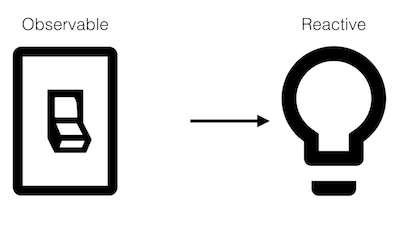

# Reactive Programming: a gentle introduction

In this post I want to introduce you to Reactive Programming, it's benefits, and why should you care.

<p align="center">

  
  Credit: Dan Lew[^1]

</p>

Even developers already using Reactive Programming Frameworks (ex: Angular) struggle with this concept.
It is something *mysterious*, and *complex*, often limiting its usage.
However, coding in RP gives very **powerful powers**, that are clearly underestimated.
So today, I will try to clear up this mystery.

## Reactive programming

Let's begin with a simple definition:

> Reactive programming is a declarative programming paradigm concerned with **data streams** and the **propagation of change**.

In Reactive Programming, we will focus on the data flow, and if something changes, then the flow updates itself.

I'll illustrate this with a switch and a light bulb:

<p align="center">

  
  Credit: Dan Lew[^1]

</p>

In [imperative programming](https://en.wikipedia.org/wiki/Imperative_programming) (this is probably your main way of coding),
the switch modifies the state of the bulb.
In this case, the switch is **proactive**, pushing new states to the bulb; whereas the bulb is **passive**,
simply receiving commands to change its state.

However, in reactive programming it's the opposite: the bulb listen to the state of the switch, and then modify itself accordingly.
In this model, the bulb is **reactive**, changing its state based on the switch's state; whereas the switch is **observable**,
in that others can observe its state changes.

<p align="center">

  
  Credit: Dan Lew[^1]

</p>

This approach makes more sense when working with streams and flows, because you won't have to update the source (the switch)
to add more sinks (more light bulbs). Each light bulb is self-managed, and doesn't rely on a modification of the code of the switch to update itself.

Maybe you've seen it, but you're already familiar with this concept:
everytime you use the method `addEventListener`, you're subscribing to Events and update other variables, elements, etc...
So, you're actually doing reactive programming.
Here, we'll push this concept further, to create amazing possibilities of interactions between data, objects, sources, etc...


## Imperative programming

Now, we will compare *imperative* vs *reactive* programming [^2].

Let's explain it with a simple assignment: `a = b + c`. `a` is being assigned the result of `b + c`.
This is done *in the instant* in **imperative programming**: the expression is evaluated, and later,
the values of `b` and `c` can be changed with no effect on the value of `a`.
This is how we code most of the time. 

On the other hand, in **reactive programming**, the value of `a` is automatically updated whenever the values of `b` or `c` change,
without the program having to explicitly re-execute the statement `a = b + c` to determine the presently assigned value of `a`.

### Imperative programming

```ts
let b = 1;
let c = 2;
let a = b + c;
b = 10;
console.log(a) // 3 (not 12 because "=" is not a reactive assignment operator)
```

### Reactive programming

Now imagine you have a special operator `$=` that changes the value of a variable
(executes code on the right side of the operator and assigns result to left side variable)
not only when explicitly initialized, but also when referenced variables
(on the right side of the operator) are changed.

```ts
let b = 1;
let c = 2;
let a $= b + c; // 3
b = 10;
console.log(a); // 12
```

Such an operator would be extremely useful: `a` would be always up-to-date.
We may start to imagine new langues and frameworks using this paradigm, and having quite powerful features.
This is especially true for [MVC](https://en.wikipedia.org/wiki/Model%E2%80%93view%E2%80%93controller) architectures,
where reactive programming can facilitate changes in an underlying model that are reflected automatically in an associated view
(typically an UI framework like Angular of React for a web application).

## @lirx/core as a framework

The most popular reactive framework is [ReactiveX](https://reactivex.io/), and it's javascript implementation [RxJS](https://rxjs.dev/).
However, this library has the following issues:

- it lacks of clear documentation (you need a master in reactive programming, to understand even the simplest functions),
and some parts of the documentation are outdated, or simply don't exist.
- it is based on `states` ('next', 'error' and 'complete') instead of pure data flow, which restrains many operators,
and confuse users when building complex interactions. 
- its design limits its performance as well as the resulting bundle size.

Instead, I'll use [@lirx/core](/docs/documentation/getting-started/introduction/), and  show you how simple is it to implement the previous example:


```ts
const [$b, b$] = let$$(1);
const [$c, c$] = let$$(2);
const a$ = add$$(b$, c$); 

a$(a => console.log(a)); // 3

$b(10); // a$ => 12
```

I will break down the code, to explain each part in detail:

```ts
const [$b, b$] = let$$(1);
```

The [let$$](/docs/reference/let/) function allows us to create a *mutable reactive variable*.
We usually split the result in two constants:

- `$b`, an **[Observer](/docs/reference/observer/)**, to **set** the value
- `b$`, an **[Observable](/docs/reference/observable/)**, to **read** it

Moreover, as you probably guess, we've initialed `b` with the value `1`.

We repeat the process for `c`, and have now two reactive variables.

Then we have to perform the sum:

```ts
const a$ = add$$(b$, c$); 
```

Here we declare `a$` as the addition of `b$` and `c$`,
using the function [add$$](/docs/reference/reactive-add/).
All of these variables are Observables.
In consequence, if any of `b$` or `c$` changes, then `a$` changes too.

Since `a$` is an Observable, we have to **subscribe** to it in order to read its value (because this one changes over time):

```ts
a$(a => console.log(a));
```

`b` and `c` already have a value, as a result, we'll immediately see `3` logged.

Finally, if we update `b` writing:

```ts
$b(10); 
```

`a$` will instantly change to `12`, and this value will be logged.

## Conclusion

This is **just the tip of the iceberg**. As you probably guess, adopting a reactive programming approach gives you very powerful tools,
to design **clear** and **organized** data flows.

A stream can be used as an input to another one. Even multiple streams can be used as inputs to another stream.
You can merge two streams.
You can filter a stream to get another one that has only those events you are interested in.
You can map data values from one stream to another new one. Etc.

This way you'll be able to create well-defined and **robust** streams of events and data, and you'll have the tools to create flow that match perfectly
and instinctively the requirements of stable and large applications perfectly fitting your needs.

I highly recommend you to stop thinking purely in imperative programming and start practicing reactive programming to discover an amazing world of new possibilities.

I guarantee you won't regret it 🦸


## About @lirx/core

[@lirx/core](/docs/documentation/getting-started/introduction/) **is a Reactive Programming framework** with a lot of prebuild functions,
clear documentations and many examples to teach you how to become a master of RP.
It allows you to develop complex applications and pipelines that scale easily.
Moreover, it is the [fastest and smallest](/docs/documentation/performances/)
javascript library for `Reactive Programming`.
So it's a good candidate to start your journey with Observables.

Feel free to test this library, share it and give your feedbacks.


[^1]: [Dan Lew - An Introduction to Functional Reactive Programming](https://blog.danlew.net/2017/07/27/an-introduction-to-functional-reactive-programming/)
[^2]: [Wikipedia - Reactive programming](https://en.wikipedia.org/wiki/Reactive_programming)

