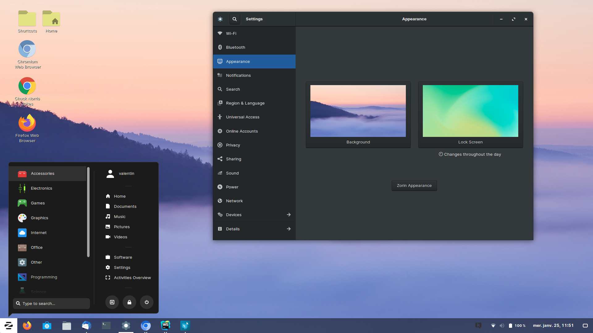

# 3 years of linux as a developer

Cet article a pour vocation de partager mon expérience en tant qu'utilisateur Linux quotidien.
Ses pours et contres, et pourquoi vous devriez, vous aussi, peut être tenter l'expérience.

Je vais essayer d'etre avant tout factuel, et ne pas insister sur les valeurs défendues.
Même si c'est un point très important de Linux (open source, communautaire, gratuit, etc...), ce n'est pas ce qui attire le plus et garde les utilisateurs.

## Avant de passer à Linux

Commençons par le début: j'ai toujours été un utilisateur Windows.

Comme pour beaucoup, c'est mon premier OS. Son interface est simple et rapide à prendre en main,
il propose beaucoup de fonctionnalités, est plutôt bien configurable et offre une grande liberté à ses utilisateurs.
De plus, étant l'OS le plus utilisé, il est aussi la cible privilégiée des developers:
quand on crée un programme, il doit prioritairement fonctionner sous Windows.
De ce fait, c'est L'OS avec le plus d'applications, et où le plus de jeux vidéos fonctionnent (je ne suis pas un gamer, mais beaucoup le sont, et cela a son importance).

À plusieurs reprises, j'ai essayé MacOS, mais son interface, leurs valeurs et leurs façons ne me correspondent pas du tout:
l'utilisateur est constamment pris pour un "incapable", et on se retrouve avec peu de configuration possible et un écosystème très fermé.
Tout est fait pour limiter au maximum les possibilités de l'utilisateur (pour le protéger de lui-même j'imagine ?).
Cela offre une bonne experience utilisateur pour un débutant, mais pour un bidouilleur tel que moi, ou encore un développeur,
ces limites sont extrêmement contraignantes.

Aillant commencé à coder jeune (2004 - 12ans), dans mon enfance, j'ai aussi touché à plusieurs reprises à Ubuntu (serveur et desktop),
C'était à cette époque, le plus simple d'utilisation et il offrait une excellente expérience utilisateur vis à vis de ses homologues.

Mais jamais en tant qu'OS principal, car certains points me semblaient rédhibitoires:

- l'interface est peu intuitive et ergonomique: tout change, les menus, les options, les fenêtres, la configuration, etc... et souvent on se retrouve à devoir faire des galipettes pour des choses toutes simples.
- les logiciels sont limités, et bien souvent nos applications préférées n'existent pas sous Linux.
- pas mal de "bugs" ou de mauvaises configurations qui nécessitent d'ouvrir le terminal.
- une façon de penser les fichiers et io bien particulière et déconcertante, car non intuitive.

En quelques mots: une expérience utilisateur bien moins bonne que la concurrence.

## Quand je suis passé à Linux

Historiquement, Linux a et continue d'être cantoné aux serveurs.
Il possède de nombreuses distributions dédiées à cet usage qui font un excellent job, ce qui le place en maitre dans ce domaine.

De son côté, Ubuntu desktop, a tenté, durant de nombreuses années, de démocratiser Linux auprès du grand public.
On peut même dire que c'était le seul à offrir une alternative crédible aux autres OS.

Mais, comme vu précédemment, son interface peu intuitive, ainsi que son incapacité à exécuter des applications Windows (les plus répandues),
ne lui ont jamais permis de décoller (historiquement). 

Sauf que voilà, depuis quelques années, de nouvelles alternatives desktop basées sur Linux ont vu le jour
(Pop!_OS, Linux Mint, Manjaro, ZorinOS, et même Ubuntu dans ces récentes releases).
Et ont peu dire quelles fonctionnent tres bien: interface revue, applications plus ergonomiques, nouveaux outils intégrés à l'OS,
installation facile et support d'applications jusque-là limités à Windows.
Bref, on peut dire qu'en quelques années, l'écosystème Linux a considérablement évolué en proposant de plus en plus un OS utilisable par n'importe qui,
et capable des mêmes prouesses que ses concurrents.

En 2019, j'ai quitté mon ancien job, pour rejoindre une plus grande entreprise.
À ce moment-là, on m'a donné un nouvel ordinateur portable et on m'a laissé le choix de l'OS.
En tant que développeur, il me faut un OS où la plupart des outils fonctionnant sur serveur doivent aussi fonctionner sur mon ordinateur
(docker, npm, node, etc...), et où je puisse aussi utiliser des applications de productivités ou du quotidien (webstorm, chrome, slack, ...).

Je me suis donc orienté vers un Linux, et après avoir essayé plusieurs distributions, je me suis arrêté sur ZorinOS:

Je souhaitais une interface proche de Windows, configurable et facile à prendre en main, et c'est celui qui m'a offer la meilleure expérience
(même si j'ai aussi beaucoup apprécié Pop!_OS).
Je ne vous cache pas, qu'au début, je sentais que cela allait être difficile: nouvelle interface, appréhension sur la compatibilité des logiciels, etc...
Mais ce que je peux vous dire c'est qu'aprés 3 ans d'utilisations consécutives pour le travail et pour mon usage personnel, j'ai laissé tombé mon Windows.

En voici les raisons.

### Installation

Ces nouvelles distributions offrent une installation extrêmement intuitive, plus rapides que Windows et avec des fonctionnalités très intéressantes comme:

- La possibilité de tester l'OS sans devoir l'installer. C'est un énorme plus pour choisir la distribution qui vous convient le plus.
- La possibilité d'installer votre OS sur une partition totalement encryptée. Si vos fichiers sont sensibles, c'est parfait pour vous.
Windows offre aussi cette possibilité, mais ce n'est pas là par défaut (donc les machines préinstallées ne sont pas encryptées).
Par conséquent, la plupart des données présentes sur votre ordinateur, sont libres d'accès si votre disque dur est volé ou emprunté.
- La possibilité d'installer votre Linux en dual boot, et conservant ainsi votre autre OS.

De plus, l'installation est à la portée de n'importe qui: il suffit de se rendre sur leurs sites pour télécharger la distribution, gratuite, bien plus légère qu'un Windows
et qui souvent inclut un petit programme pour la rendre bootable sur une clef USB.
Ici, tout est fait pour rendre le processus le plus simple et rapide possible.

Un autre point essentiel: Linux fonctionne sur pratiquement n'importe quelle machine:

- un Windows actuel prend environ 50Go, là où un Linux en prend moins de 5 en moyenne. Linux utilise aussi moins de RAM et moins de CPU.
En conséquence, votre Linux boot plus vite, et vous pouvez l'installer sur des machines avec peu de ressources. Si vous avez un ordinateur peu performant
(ex: budget serré ou ancienne machine d'occasion), alors Linux est une très bonne alternative pour avoir une expérience agréable et avec mois de ralentissements.
- linux fonctionne sur presque n'importe quel architecture, ce qui permet par exemple d'avoir des ordinateurs à très petits prix tel que des raspberry pi,
parfait pour apprendre ou tout autre usage basique (ex: navigation web).

### Interface

Les nouvelles distributions ont fait d'immenses efforts sur leurs interfaces, et c'est payant !
Par exemple, ZorinOS a une interface très similaires à Windows, aussi bien dans la gestion des fenêtres, du bureau, des menus, des interactions et des raccourcis.
De plus, sa configuration est semblable et offre de nombreuses possibilités.
Bref, on prend très vite les choses en mains et on ne se sent pas du tout perdu.
Si vous venez de Windows, alors ZorinOS vous offrira une expérience très proche.
Pourtant, c'était un point qui me faisait très peur, suite à mes précédentes deceptions avec Ubuntu.
Tout, n'est pas parfait d'ailleurs: on se retrouve parfois à devoir rentrer quelques lignes de commandes pour des configurations qui pourraient nous sembler toutes simples,
notamment sur la gestion des écrans (résolution, refresh-rate, zoom, écrans multiples, etc...), ou certaines configurations de clavier.

### Mise à jour et applications

Qui n'a jamais été soulé par les mises à jour de Windows ? 

On a l'impression qu'il y en a toutes les semaines, que ça dure à chaque fois plusieurs minutes, que l'OS vous les impose et que parfois cela arrive au pire moment.
Sans compter la taille impressionnante et toujours grandissante de votre OS (avec de temps en temps des mises à jour de 10Go).
Occasionnellement, une mise à jour change profondément l'interface, déplace des fichiers ou casse carrément votre Windows.
C'est rare, mais ça arrive, car on a tous déjà été témoins de ce genre d'évènements.

La gestion des applications est, elle aussi, catastrophique quand on compare avec d'autres OS:

- les applications doivent implementer leur propre mécanisme d'installation, de mise à jour et de désinstallation.
Par conséquent, il est très fréquent de se retrouver avec des fichiers en trop, car mal nettoyés, ou tout simplement non supprimés.
- les applications n'ont pas de droits limités, peuvent s'installer n'importe où et modifier n'importe quoi.
Cela pose des soucis évident de droits et tant à avoir un OS de plus en plus lent, car de plus en plus "impropre".

Pour toutes ces raisons, il est fréquent de devoir réinstaller occasionnellement une version propre de son Windows,
car ce dernier se dégrade inévitablement petit à petit jusqu'à rendre la machine de son utilisateur trop lente.
Si vous comparez avec Android par exemple, vous verrez tout de suite la difference: les applications sont parfaitement encapsulées,
leurs droits bien définis et les mises à jour se font de manière transparente.

Eh bien sous Linux, tout est très différent:

- les applications proviennent majoritairement de plusieurs repos qui forment un store.
- la mise à jour de l'OS ainsi que celle des applications est automatique.
- les applications ont des droits bien spécifiques et leur propre dossier.
- si une application n'a plus besoin d'un package (un bout d'autre application), alors ce package est automatiquement supprimé. Même chose pour l'OS.

L'expérience utilisateur est infiniment meilleure. 
Dit comme ça, cela peut paraitre bête et futile, mais quand vous avez des dizaines d'applications, voire des centaines et que tout se met à jour proprement et automatiquement,
et bien c'est juste extraordinaire. C'est même une fonctionnalité dont on ne peut plus se passer et une des raisons qui m'a fait quitter Windows.
Tout est à jour, constamment, automatiquement, proprement, sans résidus qui trainent.

- la communauté => bug => quelqu'un a la solution, alors que sur windows cest le service technique
- os plus léger
- interface similaire a windows
- peu de bug
- systeme de fichier qui supporte plein de protocols
- maj automatiques

- soucis: mois plug en play (ex: cable hdmi, connection avec des comptes, etc...)

