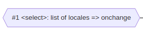
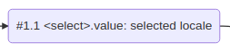
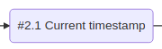

# Example

It's time to practice 👨‍💻️!

In this part, we will create an Observable based application, displaying the current date and time formatted according to a selected language.

:::note

Date (and Time) representations vary between countries, so Observables are really great for internationalization (often abbreviated to i18n).

:::

We will start by creating a &lt;select&gt; element containing **a list of languages**.
We'll conceive an Observable around it, which will emit the selected language per the user's locale.
We will then create another Observable from the **current date and time**,
and **format** this date and time according to the selected locale.
Finally, we'll display the result into an &lt;output&gt;.

I've created a dataflow to make it clearer:


## Set up the initial code

I'm not going to dwell on this part, as it's just usual javascript code.

### Create a select and output element

The following piece of code, will simply create a &lt;select&gt; element containing a list of languages.

```ts
const DEFAULT_LANGUAGES = [
  'en',
  'fr',
  'de',
  'it',
  'es',
];

function createLocaleSelectElement(
  languages: string[] = DEFAULT_LANGUAGES,
): HTMLSelectElement {
  const selectElement = document.createElement('select');

  const displayNames = new Intl.DisplayNames(navigator.languages, { type: 'language' });

  for (let i = 0, l = languages.length; i < l; i++) {
    const locale: string = languages[i];
    const optionElement = document.createElement('option');
    optionElement.value = locale;
    optionElement.innerText = displayNames.of(locale);
    selectElement.appendChild(optionElement);
  }

  return selectElement;
}
```

Next, we create and inject the &lt;select&gt; and &lt;output&gt; elements into the body.

```ts
const selectElement = createLocaleSelectElement();
document.body.appendChild(selectElement);

const outputElement = document.createElement('output');
document.body.appendChild(outputElement);
```

### Format the date from a locale

Date representations vary differently between countries, so we have to account for the selected locale.

Let's write a function that accepts a *locale* and a *date*, and returns this formatted date and time as a
string:

```ts
function formatDate(
  locale: string,
  date: number | Date,
): string {
  return new Intl.DateTimeFormat(locale, {
    year: 'numeric', month: 'short', day: 'numeric',
    hour: 'numeric', minute: 'numeric', second: 'numeric',
  }).format(date);
}
```

It uses, the Intl API.
If you're not familiar with it, you may consult [the documentation on the MDN website](https://developer.mozilla.org/fr/docs/Web/JavaScript/Reference/Global_Objects/Intl/DateTimeFormat).

## Build the pipeline

The first thing to do is to create an Observable listening on the `change` Event of the &lt;select&gt;:



We'll simply use the function [fromEventTarget](/docs/reference/from-event-target/):

```ts
const selectElementChange$ = fromEventTarget(selectElement, 'change');
```

It creates an Observable initiating an EventListener through `addEventListener` for the `change` event on this &lt;select&gt;.
When such an Event occurs, it is transmitted through this Observable.

As we want the &lt;select&gt;'s value, instead of a `change` Event, we have to `map` it:



... using the inlined ObservablePipe [map$$](/docs/reference/map-observable-pipe/):

```ts
const locale$ = map$$(selectElementChange$, () => selectElement.value);
```

This ObservablePipe, passes the incoming values through a `map` function and emits the result into a new Observable. 
In our case, it transforms the Events sent by `selectElementChange$` into the current value of the &lt;select&gt;.
So we end up with an Observable emitting the locale selected by the user, when the &lt;select&gt; changes.

However, because `selectElementChange$` **only triggers when a *change* occurs**, we have to use [reference](/docs/reference/reference/) and [merge](/docs/reference/merge/)
in conjunction, to dispatch the **current** value of this &lt;select&gt; properly.

Which finally gives us:

```ts
const locale$ = merge([
  reference(() => selectElement.value),
  map$$(fromEventTarget(selectElement, 'change'), () => selectElement.value)
]);
```

If you're confused, do not hesitate to take a look at the documentation of these functions.
At this point, we have an Observable emitting the locale selected by a user.

---

Let's now focus on the second part of the data-flow i.e. the current date.
For this, we have to create an Observable that **periodically** emits the current timestamp.

Let's begin by using the function [interval](/docs/reference/interval/) to create an Observable emitting a value every second:


```ts
const everySecond$ = interval(1000);
```

As we're only interested in the current timestamp, we'll have to `map` this Observable like we did for the &lt;select&gt;'s value:




```ts
const date$ = map$$(timer$, () => Date.now());
```

It transforms the "ticks" sent by the previous Observable, into the current date expressed as a timestamp.
So, we now have an Observable emitting the current date every second.

---

The last step is to combine the Observables `locale$` and `currentTimestamp$`, to convert their incoming values into a formatted date.


The easiest way to achieve this, is using the function [function$$](/docs/reference/optimized-reactive-function/).
It combines many Observables, and, when any of them emits, it calls a "map" function to convert these values into another one.

```ts
const output$ = function$$(
  [locale$, date$],
  formatDate,
);
```

If any of `locale$` or `date$` emits, the function `formatDate` is called with their respecting incoming values,
and the result is emitted into a new Observable.

So, we have now, an Observable sending every seconds the current date as a string, and this date is formatted according to a selected locale.
This is exactly what we wanted!

To conclude, the last step would be to subscribe to it, and output the received value into the &lt;output&gt; element:

```ts
output$((value: string) => {
  outputElement.value = value;
});
```

---

Here's the entire snippet:

```ts
const locale$ = merge([
  reference(() => selectElement.value),
  map$$(fromEventTarget(selectElement, 'change'), () => selectElement.value)
]);

const date$ = map$$(interval(1000), () => Date.now()); 

const output$ = function$$(
  [locale$, date$],
  formatDate,
);

output$((value: string) => {
  outputElement.value = value;
});
```

This is **far concise** than what we would have had to write without Observables.

Some important points to note about Observables:

- they are easy to chain or combine, giving us the possibility to handle long and complex dataflow in just a few lines of code,
thereby decreasing the chances of errors.
- they are PUSH sources, meaning they are extremely useful when a state or a value depends on others:
  if some of them change, derived values will update too.
- subscribing and unsubscribing is especially simple, and guarantees no memory leak (all resources are properly freed).

In front-end applications, Observables are particularly useful to manage the state of all our components, update the DOM nodes, and
listen on some events. They work exceptionally well with the DOM.
