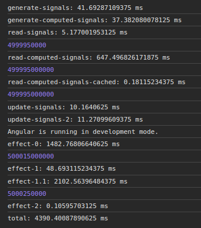
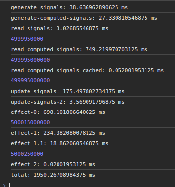

# vs Angular

---

**SYSTEM CONFIGURATION:**

- CPU: Intel(R) Core(TM) i7-8750H CPU @ 2.20GHz (6 cores / 12 threads)
- Memory: 32Go
- OS: Ubuntu 20.04 LTS
- Browser: Chrome 121
- Date: 2024-02-20
- @lirx/core: 1.6.0
- angular: 17.2.1

---

First, we think it's important to notice that `@lirx/core` has a different implementation of Signals that Angular.
*This is not a fork, nor a rework, but rather a separate implementation.* 
They share some concepts and optimization, but we have a different approach on the Signals' updates.

When benchmarking, we may say that the Angular's Signals are really well optimized,
and achieving similar or better results was a real challenge, so we may felicitate their teams for such an amazing work.

But enough congratulations, and let's jump into the benchmarks, exposing the difference between the two.

## Benchmark


<details>
  <summary>Expand the code</summary>


```ts
function run(): void {
  console.time('total');
  console.time('generate-signals');
  const signals = Array.from({ length: 1e5 }, (_, index: number) => signal(index));
  console.timeEnd('generate-signals');

  console.time('generate-computed-signals');
  const computedSignals = Array.from({ length: 1e5 }, () => computed((): number => {
    return signals.reduce((sum: number, signal: IReadonlySignal<number>) => {
      return sum + signal();
    }, 0);
  }));
  console.timeEnd('generate-computed-signals');
  computedSignals.splice(1e2, Number.POSITIVE_INFINITY);

  let value: number = 0;

  console.time('read-signals');
  value = signals.reduce((sum: number, signal: IReadonlySignal<number>) => {
    return sum + signal();
  }, 0);
  console.timeEnd('read-signals');
  console.log(value);

  console.time('read-computed-signals');
  value = computedSignals.reduce((sum: number, signal: IReadonlySignal<number>) => {
    return sum + signal();
  }, 0);
  console.timeEnd('read-computed-signals');
  console.log(value);

  console.time('read-computed-signals-cached');
  value = computedSignals.reduce((sum: number, signal: IReadonlySignal<number>) => {
    return sum + signal();
  }, 0);
  console.timeEnd('read-computed-signals-cached');
  console.log(value);

  console.time('update-signals');
  signals.forEach((signal: ISignal<number>): void => {
    signal.set(signal() + 1);
  });
  console.timeEnd('update-signals');

  console.time('update-signals-2');
  signals.forEach((signal: ISignal<number>): void => {
    signal.set(signal() + 1);
  });
  console.timeEnd('update-signals-2');

  let cmd: number = 0;

  console.time('effect-0');
  effect(() => {
    if (cmd === 0) {
      cmd++;
      value = computedSignals.reduce((sum: number, signal: IReadonlySignal<number>) => {
        return sum + signal();
      }, 0);
      console.timeEnd('effect-0');
      console.log(value);

      queueMicrotask(() => {
        console.time('effect-1');
        signals.forEach((signal: ISignal<number>): void => {
          signal.set(signal() + 1);
        });
      });
    } else if (cmd === 1) {
      cmd++;
      console.timeEnd('effect-1');
      console.time('effect-1.1');
      value = signals.reduce((sum: number, signal: IReadonlySignal<number>) => {
        return sum + signal();
      }, 0);
      console.timeEnd('effect-1.1');
      console.log(value);
      queueMicrotask(() => {
        console.time('effect-2');
        signals[0].set(0);
      });
    } else if (cmd === 2) {
      cmd++;
      console.timeEnd('effect-2');
      console.timeEnd('total');
    }
  });
}

run();
```

</details>


[//]: # (TODO link to repo)

## Results

#### Angular



#### @lirx/core



#### Comments

When **creating signals** (`generate-signals`), both frameworks are extremely efficient, and generating millions of them is not a problem.
The same is true for `computed` (`generate-computed-signals`), where no significant differences may be observed.

Reading signals is extremely fast too (`read-signals`, `read-computed-signals`), both caching the values (`read-computed-signals-cached`),
avoiding unnecessary recomputation, and having similar performances.

Differences happens when we update signals (`update-signals`):
Angular is far faster (10ms vs 175ms) as it simply marks the signal as `outdated` without notifying its observers.
In the contrary, `@lirx/core` chose to immediately notify the observers, costing more to mark all observers as `outdated` too.
However, consecutive signal writes (`update-signals-2`) have similar performances, with a small advantage for `@lirx/core`.

The choice to notify immediately the observers, was done to increase the performances when Signals are observed through `effect`.
And we may immediately see the difference: the first `effect` (`effect-0`) takes ~1500ms with angular versus ~700ms with `@lirx/core`.
A gain of 800ms ! For applications using a lot of `effect`, this is a huge boost.
We consider that in practice, we will use far more `effect` to be able to observe signal changes (to update the DOM for example),
that we'll mutate their value in an unobserved context.

`effect-1` updates the values of all the signals, and we may see that Angular remains the champion (48ms vs 234ms)
as we have the same behaviour as `update-signals`. But the gap is reduced.

However, with `effect-1.1` (when the effect is called again due to the previous changes),
we may see the absolute boost of immediately notifying the observers:
2100ms for Angular versus 20ms with `@lirx/core`. It's just crunching the stats.

If we cumulate both writing (faster on Angular) and observing (faster on `@lirx/core`), we get: 48 + 2102 = 2150ms vs 234 + 18 = 252ms.
So `@lirx/core` outperforms Angular by a factor of **8** (if we consider that observing the values is more important that updating them).
But fundamentally, this is the purpose of Signals: being observable and react to their changes.
So we think our choice is the right one.


Finally, if we focus on the resulting size, both packages are efficient: minziped Angular's signals are around ~2kB and `@lirx/core` ~1.3kB.
However, `@lirx/core` has the advantage to be embeddable without all the Angular's framework (which adds a minimum of ~23kB minziped, resulting in a minimal application of ~25kB).
