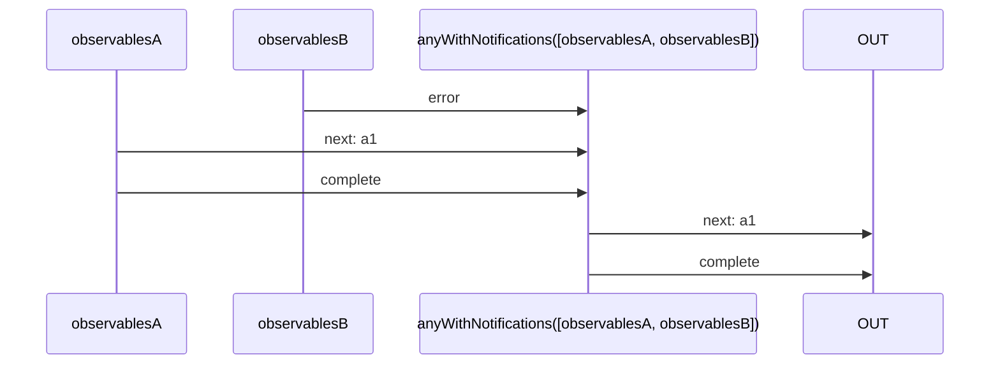
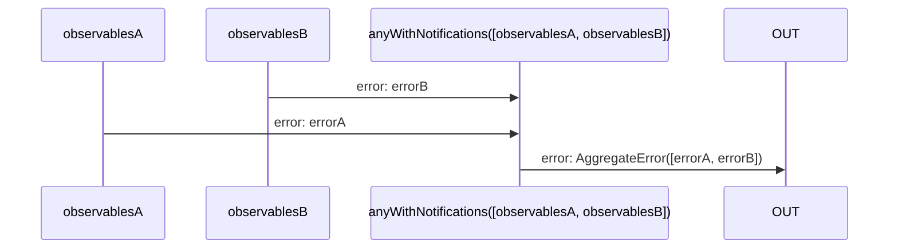

# anyWithNotifications

Alternative: `anyN`

### Types

```ts
function anyWithNotifications<GObservables extends IGenericAnyInObservables>(
  observables: GObservables,
): IObservable<IAnyObservableNotifications<GObservables>>
```

### Definition

Waits for the first observable to send a `complete` Notification,
or all observables sending an `error` Notification.

If it received a `complete` Notification, it will emit the last value received through the `next` Notifications of this observable,
followed by a `complete` Notification.

If it received only `error` Notifications, it will send an `error` Notification (whose value is an AggregateError).

This is equivalent of `Promise.any`.

### Diagrams

#### If one completes



#### If one errored



### Examples

#### Example 1

```ts
const observable0$ = switchMap$$(timeout(1000), () => singleN<'a1'>('a1'));
const observable1$ = switchMap$$(timeout(500), () => throwError(new Error(`Failed`)));

const subscribe = anyWithNotifications([observable0$, observable1$]);

subscribe((value: IDefaultNotificationsUnion<'a1'>) => {
  console.log(value);
});
```

Output:

```text
// t = 1000ms
'next', 'a1'
'complete', undefined
```

#### Example 2

```ts
const observable0$ = switchMap$$(timeout(1000), () => throwError(new Error(`Failed A`)));
const observable1$ = switchMap$$(timeout(500), () => throwError(new Error(`Failed B`)));

const subscribe = anyWithNotifications([observable0$, observable1$]);

subscribe((value: IDefaultNotificationsUnion<any>) => {
  console.log(value);
});
```

Output:

```text
// t = 1000ms
'error', AggregateError
```

