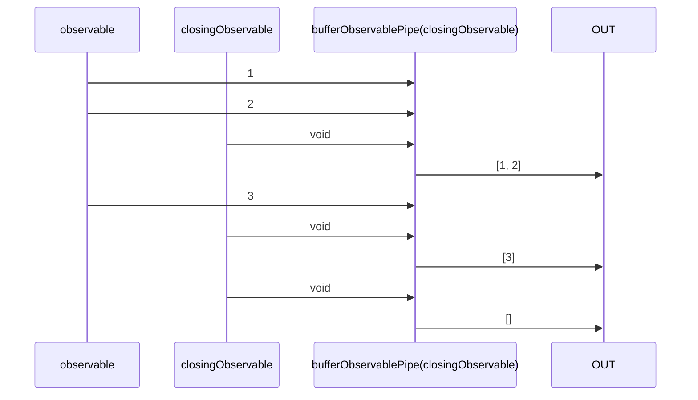

# bufferObservablePipe

Alternative: `buffer$$$`

Inlined: `bufferObservable`, `buffer$$`

### Types

```ts
function bufferObservablePipe<GValue>(
  closingObservable: IObservable<any>,
): IObservablePipe<GValue, GValue[]>
```

### Definition

This pipe appends into an array the received values until `closingObservable` emits a value.
When `closingObservable` emits a value, this array is emitted, and a new one is created for the next values.

The RxJS equivalent is [buffer](https://rxjs.dev/api/operators/buffer).

### Diagram



### Example

#### Buffer the mouse positions on the X axis every seconds

```ts
const subscribe = pipe$$(fromEventTarget<'mousemove', MouseEvent>(window, 'mousemove'), [
  map$$$<MouseEvent, number>((event: MouseEvent) => event.clientX),
  buffer$$$<number>(interval(1000)),
]);

subscribe((positions: number[]) => {
  console.log(positions);
});
```

Output:

```text
// t = 400ms => mouse move on X = 456
// t = 600ms => mouse move on X = 897
// t = 1000ms
[456, 897]
// t = 1300ms => mouse move on X = 54
// t = 2000ms
[54]
// t = 3000ms
[]
// ...
```
