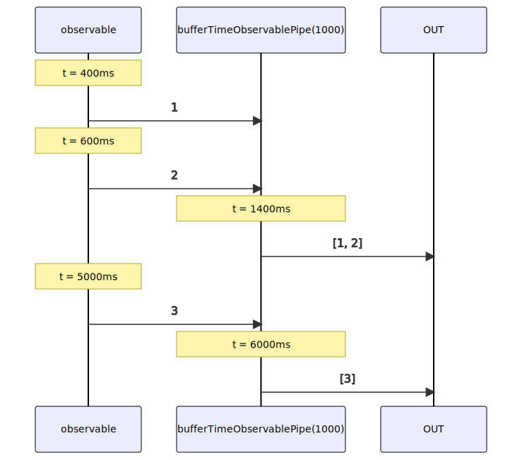

# bufferTimeObservablePipe

Alternatives: `bufferTime$$$`, `bufferT$$$`

Inlined: `bufferTimeObservable`, `bufferTime$$`, `bufferT$$`

### Types

```ts
function bufferTimeObservablePipe<GValue>(
  duration: number,
): IObservablePipe<GValue, GValue[]>
```

### Definition

This pipe appends into an array the received values until a period defined by `duration` is elapsed.
Then, this array is emitted, and a new one is created for the next values.

:::caution

This is not equivalent to:

```ts
function bufferTimeObservablePipe<GValue>(
  duration: number,
): IObservablePipe<GValue, GValue[]> {
  return bufferObservablePipe<GValue>(interval(duration));
}
```

The timer begins only when a value is received, meaning empty arrays will never be emitted.

:::

:::caution

There is not RxJS equivalent.
[bufferTime](https://rxjs.dev/api/operators/bufferTime) does something different.

:::

### Diagram



### Example

#### Buffer the mouse positions on the X axis with a period of one second

```ts
const subscribe = pipe$$(fromEventTarget<'mousemove', MouseEvent>(window, 'mousemove'), [
  map$$$<MouseEvent, number>((event: MouseEvent) => event.clientX),
  bufferTime$$$<number>(1000),
]);

subscribe((positions: number[]) => {
  console.log(positions);
});
```

Output:

```text
// t = 400ms => mouse move on X = 456 => buffer starts
// t = 600ms => mouse move on X = 897
// t = 1400ms => buffer ends
[456, 897]
// t = 5000ms => mouse move on X = 54 => buffer starts
// t = 6000ms => buffer ends
[54]
// ...
```
