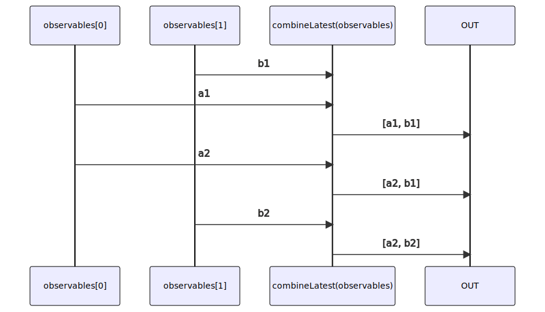

# combineLatest

### Types

```ts
function combineLatest<GObservables extends readonly IGenericObservable[]>(
  observables: GObservables,
): IObservable<ICombineLatestObservablesValues<GObservables>>
```

### Definition

Creates an output Observable which combines the values from all the Observables passed as arguments.
This is done by subscribing to each Observable in order and, whenever any Observable emits,
collecting an array of the most recent values from each Observable.
So if you pass *n* Observables, the returned Observable will always emit an array of *n* values,
in order corresponding to order of passed Observables (value from the first Observable on the first place and so on).

The RxJS equivalent is [combineLatest](https://rxjs.dev/api/index/function/combineLatest).

### Diagram



### Example

#### Combine values of 2 Observables as array

```ts
// observable generating 0, 1, 2, 3,... every 500ms
const obs1 = pipe$$(interval(500), [
  scan$$$<void, number>((i) => (i + 1), 0),
]);

// observable generating 'a', 'b', 'c',... every 550ms
const obs2 = pipe$$(interval(500), [
  scan$$$<void, number>((i) => (i + 1), 97),
  map$$$<void, string>(String.fromCharCode),
]);

// highlight-next-line
const subscribe = combineLatest([obs1, obs2]);

let startTime: number = Date.now();
subscribe((result) => {
  console.log(`${ (Date.now() - startTime).toString(10) }ms`, result);
});
```

Output:

```text
550ms: [0, 'a']
1000ms: [1, 'a']
1050ms: [1, 'b']
1500ms: [2, 'b']
1600ms: [2, 'c']
...
```
