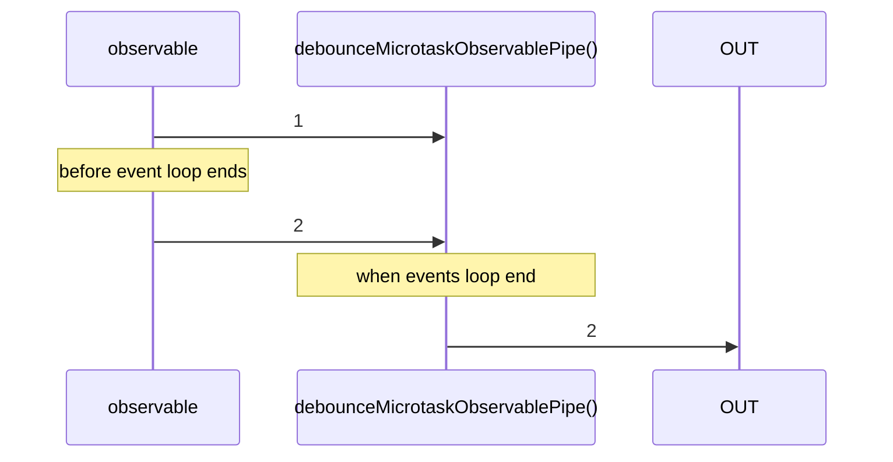

# debounceMicrotaskObservablePipe

Alternative: `debounceMicrotask$$$`

Inlined: `debounceMicrotaskObservable`, `debounceMicrotask$$`

### Types

```ts
function debounceMicrotaskObservablePipe<GValue>(): IObservablePipe<GValue, GValue>
```

### Definition

Awaits for the next event loop (`queueMicrotask`) and emits the last value received from the source Observable.

### Diagram



### Example

#### Debounce frequent values

```ts
const source = createMulticastSource<number>();

const subscribe = pipe$$(source.subscribe, [
  debounceMicrotask$$$(),
]);

subscribe((value: number) => {
  console.log('value', value);
});

// emit some values
console.log('start');
source.emit(0);
source.emit(1);
source.emit(2);
console.log('end');
```

Output:

```text
start
end
value: 2
```
