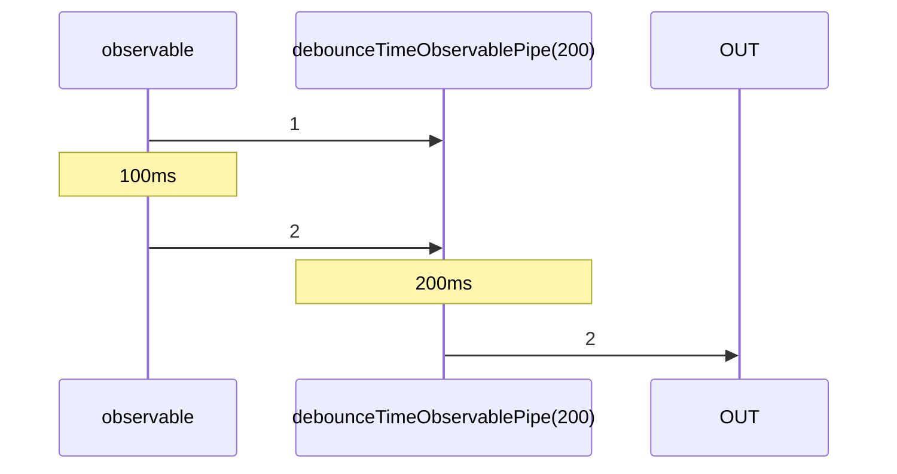

# debounceTimeObservablePipe

Alternative: `debounceTime$$$`

Inlined: `debounceTimeObservable`, `debounceTime$$`

### Types

```ts
function debounceTimeObservablePipe<GValue>(
  duration: number,
): IObservablePipe<GValue, GValue>
```

### Definition

Emits a value from the source Observable only after a particular time span has passed without another source emission.

The RxJS equivalent is [debounceTime](https://rxjs-dev.firebaseapp.com/api/operators/debounceTime).

### Diagram



### Example

#### Debounce user clicks

```ts
const subscribe = pipe$$(fromEventTarget(window, 'click'), [
  debounceTime$$$(200),
]);

subscribe(() => {
  console.log('clicked');
});
```

Timeline:

```text
// t = 0ms: user clicks on window
// t = 100ms: user clicks on window
// t = 300ms
'clicked'
```
