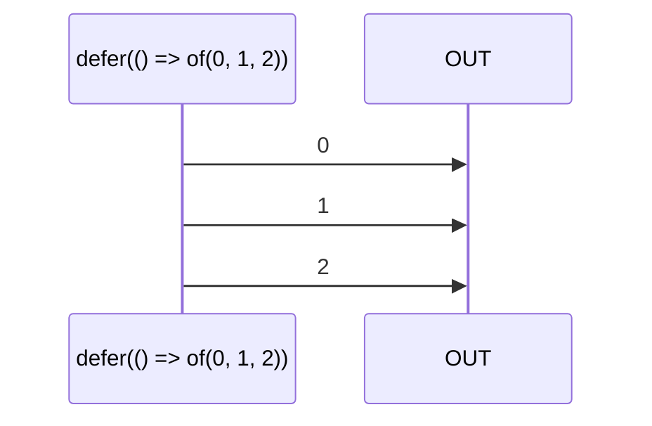

# defer

### Types

```ts
function defer<GValue>(
  factory: IDefferFactoryFunction<GValue>,
): IObservable<GValue>
```

```ts
interface IDefferFactoryFunction<GValue> {
  (): IObservable<GValue>;
}
```

### Definition

Creates an Observable, which on subscribe, will call `factory` and transmit the received
*emit* function to the returned Observable.

### Diagram



### Example

#### Deferred usage of the variable 'value'

```ts
// let's assume we don't know yet the value to assign
let value: number;

const subscribe = defer(() => single(value));

const destination = (value: number) => {
  console.log(value);
};

// LATER
value = 1;
subscribe(destination); // output '1'

value = 2;
subscribe(destination); // output '2'
```


