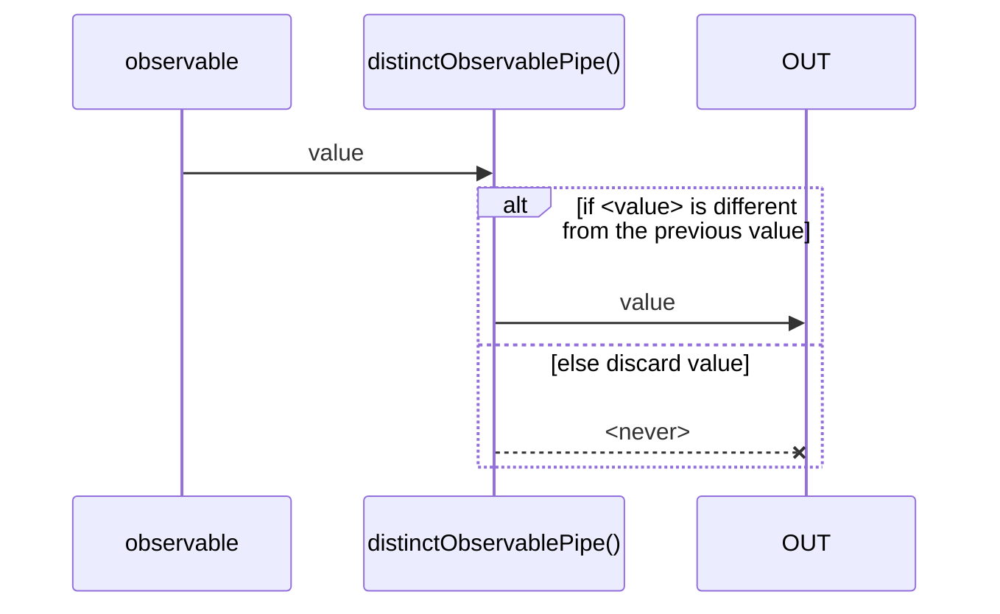
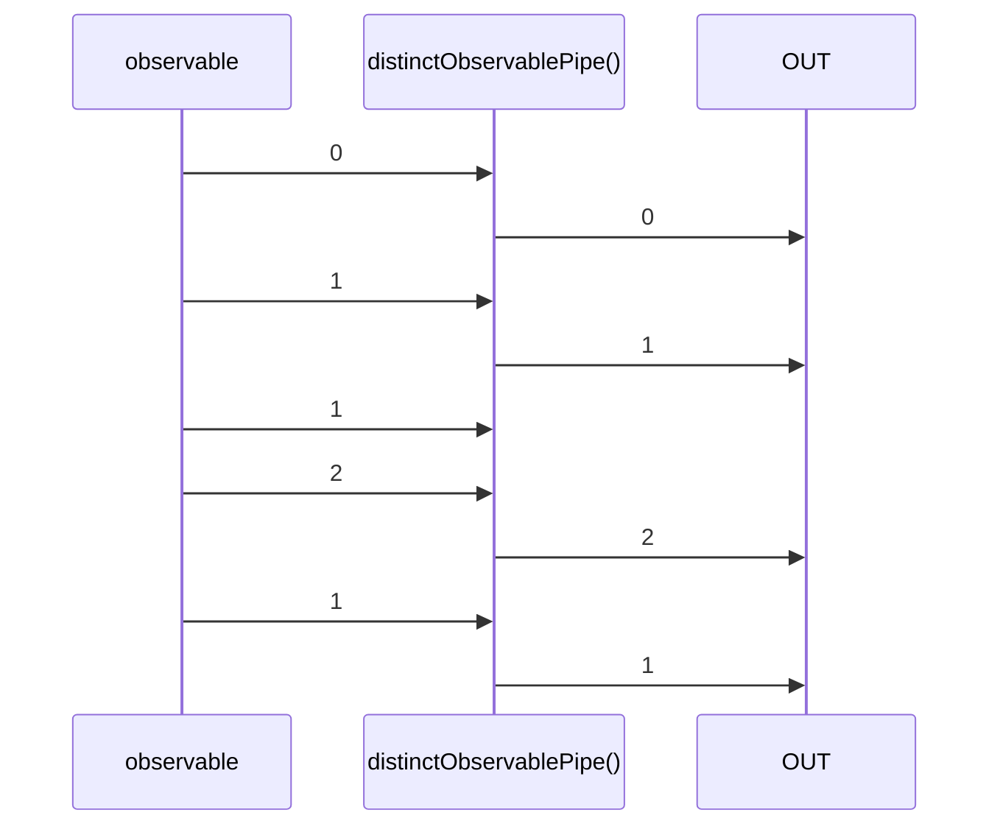

# distinctObservablePipe

Alternative: `distinct$$$`

Inlined: `distinctObservable`, `distinct$$`

### Types

```ts
function distinctObservablePipe<GValue>(
  options?: IDistinctOptions<GValue>,
): IObservablePipe<GValue, GValue>
```

```ts
interface IDistinctOptions<GValue> {
  initialValue?: GValue;
  equal?: (a: GValue, b: GValue) => boolean;
}
```

### Definition

Returns an Observable that emits all items emitted by the source Observable that are distinct by comparison from the last previous value.

The RxJS equivalent is [distinctUntilChanged](https://rxjs-dev.firebaseapp.com/api/operators/distinctUntilChanged).

It accepts an optional `options` argument:

- `initialValue`: if provided, the pipe is initialized with this value, and the first emitted value is compared with this one (`initialValue`).
Else, the first value is always transmitted.
- `equal`: this function is called to compare the *previous* and *current* value. By default, it is the strict equality comparison `===`.

### Diagram

#### Algorithm



#### Example



### Example

#### Emit only distinct values

```ts
const subscribe = pipe$$(of(0, 1, 1, 2, 1), [
  distinct$$$(),
]);

subscribe((value) => {
  console.log(value);
});
```

Output:

```text
0
1
2
1
```
