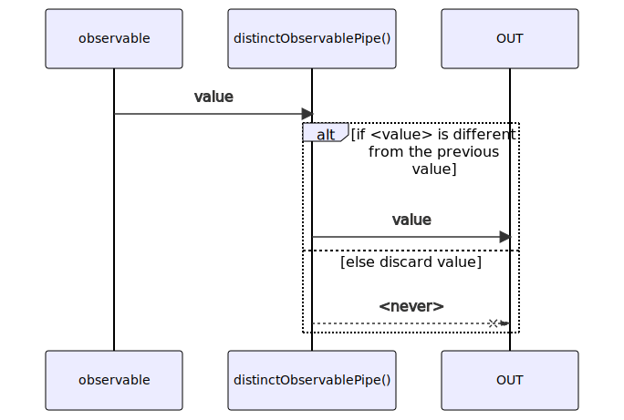
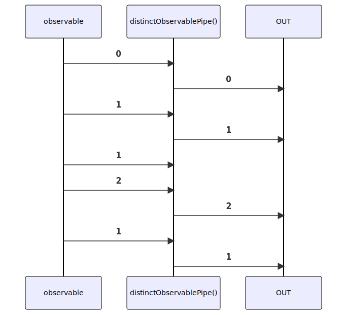

# distinctObservablePipe

Alternative: `distinct$$$`

Inlined: `distinctObservable`, `distinct$$`

### Types

```ts
function distinctObservablePipe<GValue>(): IObservablePipe<GValue, GValue>
```

### Definition

Returns an Observable that emits all items emitted by the source Observable that are distinct by comparison from the last previous value.

The RxJS equivalent is [distinctUntilChanged](https://rxjs-dev.firebaseapp.com/api/operators/distinct).

### Diagram

#### Algorithm



#### Example



### Example

#### Emit only distinct values

```ts
const subscribe = pipe$$(of(0, 1, 1, 2, 1), [
  distinct$$$(),
]);

subscribe((value) => {
  console.log(value);
});
```

Output:

```text
0
1
2
1
```
