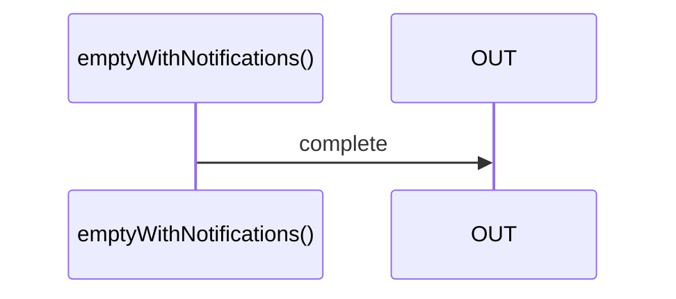

# emptyWithNotifications

Alternatives: `emptyN`, `complete`

### Types

```ts
function emptyWithNotifications(): IObservable<IEmptyObservableNotifications>
```

### Definition

Creates an Observable, which on subscribe, will emit a `complete` Notification.

It is somehow equivalent of a `Promise.resolve`, but without any value.

### Diagram



### Example

#### Create an Observable emitting a 'complete' notification

```ts
const subscribe = emptyWithNotifications();

subscribe((notification) => {
  console.log(notification.name, notification.value);
});
```


Output:

```text
'complete', undefined
```
