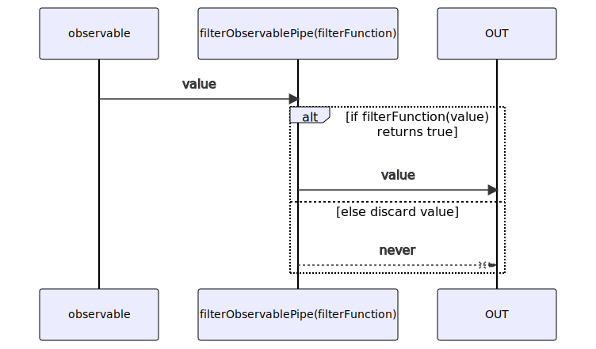
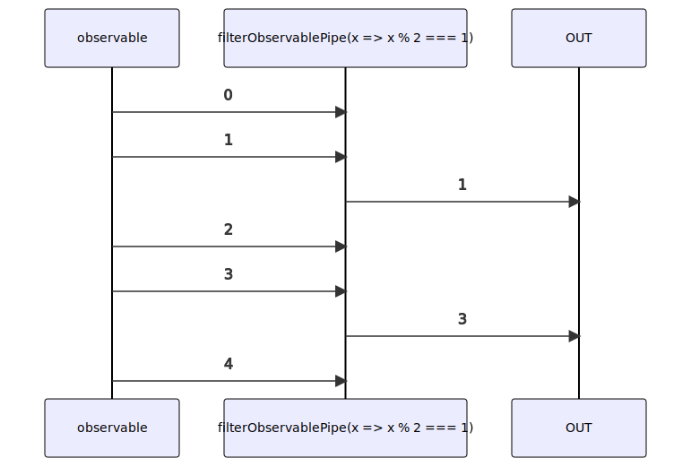

# filterObservablePipe

Alternative: `filter$$$`

Inlined: `filterObservable`, `filter$$`

### Types

```ts
function filterObservablePipe<GValue>(
  filterFunction: IFilterFunctionGeneric<GValue>,
): IObservablePipe<GValue, GValue>
```

### Definition

This pipe filters items emitted by the source Observable by only emitting those that satisfy a specified predicate `filterFunction`.

The RxJS equivalent is [filter](https://rxjs-dev.firebaseapp.com/api/operators/filter).

### Diagram

#### Algorithm



#### Example



### Example

#### Emit only the odd values

```ts
const subscribe = pipe$$(of(0, 1, 2, 3, 4), [
  filter$$$(x => x % 2 === 1),
]);

subscribe((value) => {
  console.log(value);
});
```

Output:

```text
1
3
```
