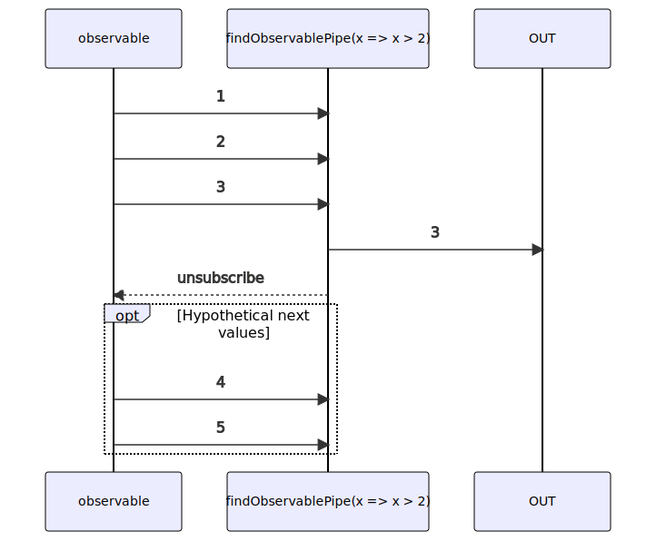

# findObservablePipe

Alternative: `find$$$`

Inlined: `findObservable`, `find$$`

### Types

```ts
function findObservablePipe<GValue>(
  condition: IFindObservablePipeConditionFunction<GValue>,
): IObservablePipe<GValue, GValue>
```

```ts
interface IFindObservablePipeConditionFunction<GValue> {
  (value: GValue): boolean;
}
```

### Definition

This pipe emits only the first value emitted by the source Observable that passes `condition` (if `condition` returns true).

The RxJS equivalent is [find](https://rxjs.dev/api/operators/find).

### Diagram

[//]: # (TODO algorithm diagram)



### Example

#### Emit only the first value greater than 2

```ts
const subscribe = pipe$$(of(1, 2, 3, 4), [
  find$$$<number>(x => x > 2),
]);

subscribe((value: number) => {
  console.log(value);
});
```

Output:

```text
3
```
