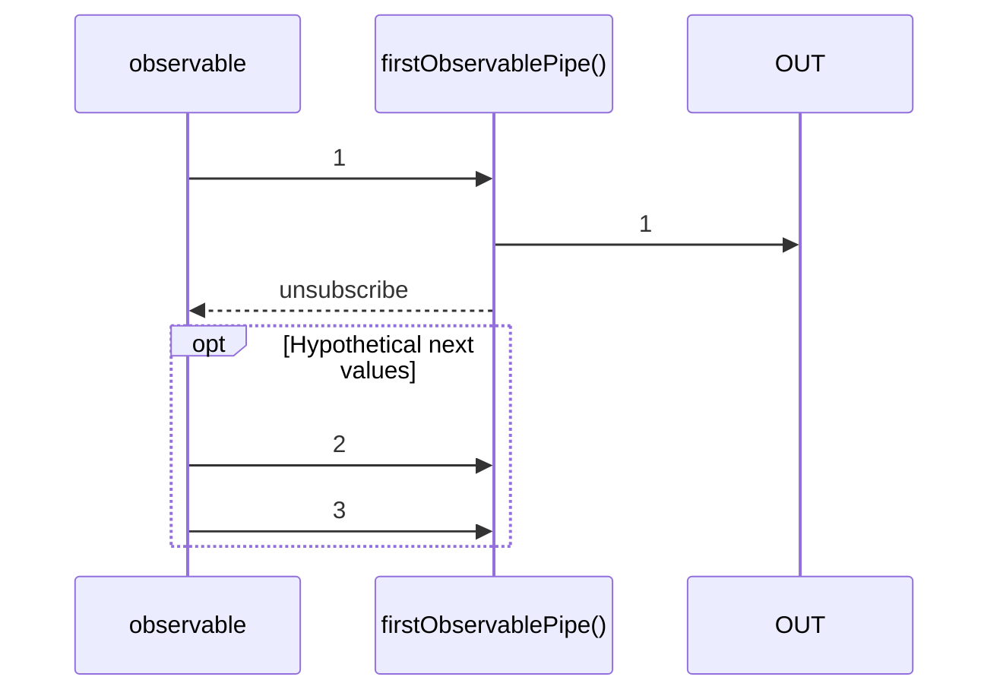

# firstObservablePipe

Alternative: `first$$$`

Inlined: `firstObservable`, `first$$`

### Types

```ts
function firstObservablePipe<GValue>(): IObservablePipe<GValue, GValue>
```

### Definition

This pipe emits only the first value emitted by the source Observable.

The RxJS equivalent is [first](https://rxjs.dev/api/operators/first).

### Diagram



### Example

#### Emit only the first value sent

```ts
const subscribe = pipe$$(of(1, 2, 3, 4), [
  first$$$<number>(),
]);

subscribe((value: number) => {
  console.log(value);
});
```

Output:

```text
1
```

