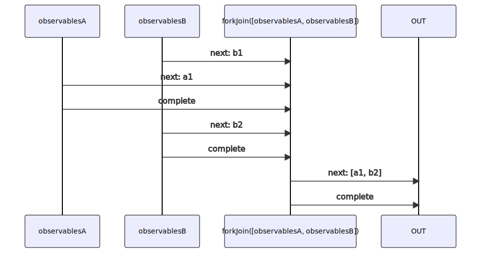
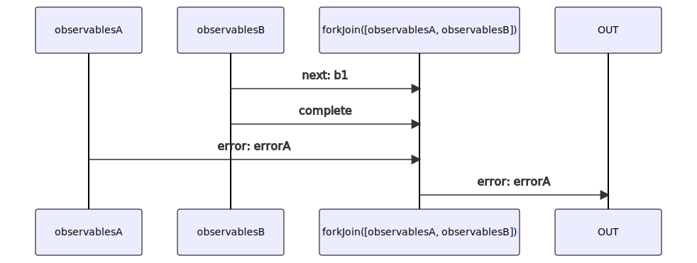

# forkJoin

Alternatives: `allWithNotifications`, `allN`

### Types

```ts
function forkJoin<GObservables extends IGenericForkInObservables>(
  observables: GObservables,
): IObservable<IForkJoinObservableNotifications<GObservables>
```

### Definition

Waits for the first observable to send an `error` Notification,
or all observables sending a `complete` Notification.

If it received an `error` Notification, it will send this `error` Notification.

If it received only `complete` Notifications, it will emit an array with the last values received through the `next` Notifications for each
observable, followed by a `complete` Notification.

This is equivalent of `Promise.all`.

### Diagrams

#### If all completed



#### If one errored



### Example

#### Example 1

```ts
const observable1$ = singleN(false);
const observable2$ = switchMap$$(timeout(2000), () => singleN(true)); // emits 'true' after 2000ms

const result$ = forkJoin([observable1$, observable2$]);

result$((notification) => {
  console.log(notification.name, notification.value);
});

```

Output:

```text
// t = 2000ms
'next', [false, true]
'complete', undefined
```
