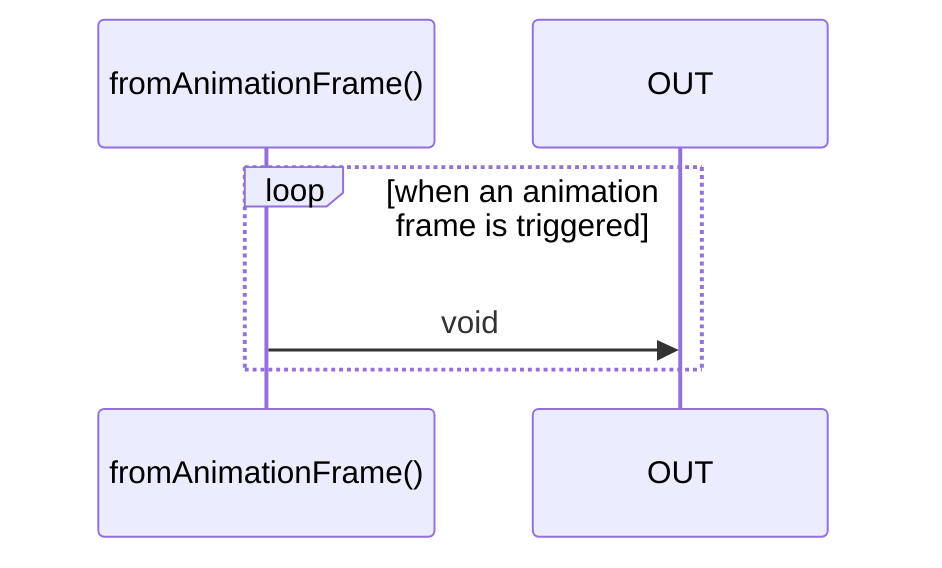

# fromAnimationFrame

### Types

```ts
function fromAnimationFrame(): IObservable<void>
```

### Definition

Creates an Observable that emits 'void' on every animation frame.

### Diagram



### Example

#### Create an animation frame Observable to draw something

```ts
const subscribe = fromAnimationFrame();

const unsubscribe = subscribe(() => {
  // draw something on a canvas
});
```

