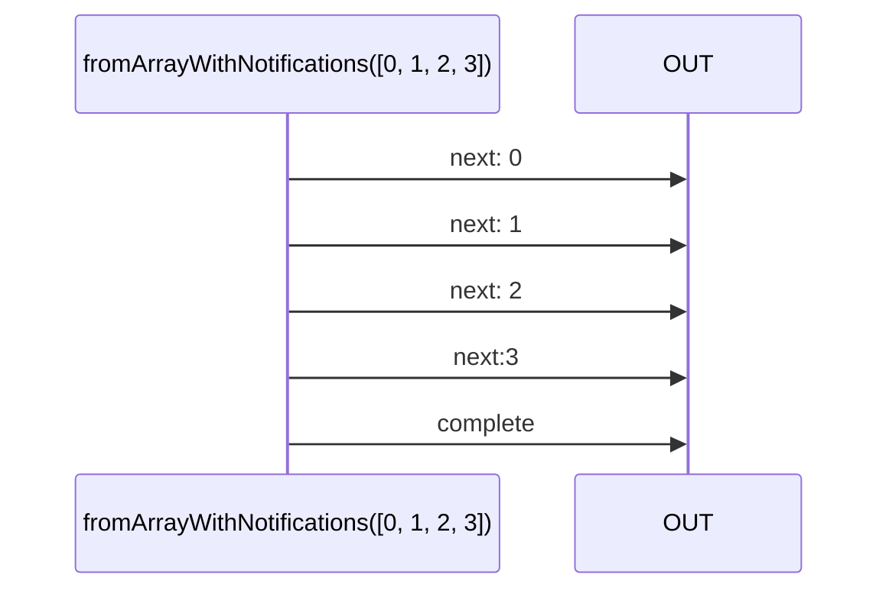

# fromArrayWithNotifications

Alternative: `fromArrayN`

### Types

```ts
function fromArrayWithNotifications<GValue>(
  array: ArrayLike<GValue>,
): IObservable<IFromArrayObservableNotifications<GValue>>
```

```ts
type IFromArrayObservableNotifications<GValue> =
  INextNotification<GValue>
  | ICompleteNotification
```

### Definition

Creates an Observable from an Array.
It emits the array's values one by one in the form of `next` Notifications and then complete (`complete` Notification).

### Diagram



### Example

#### Emit the values 0, 1, 2, 3

```ts
const subscribe = fromArrayWithNotifications([0, 1, 2, 3]);

subscribe((notification) => {
  console.log(notification.name, ':', notification.value);
});
```

Output:

```text
next: 0
next: 1
next: 2
next: 3
complete
```


