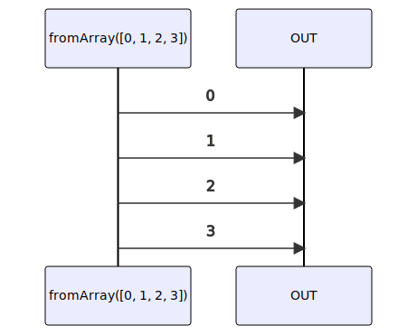

# fromArray

### Types

```ts
function fromArray<GValue>(
  array: ArrayLike<GValue>,
): IObservable<GValue>
```

### Definition

Creates an Observable from an Array. It emits the array's values one by one.

### Diagram



### Example

#### Emit the values 0, 1, 2, 3

```ts
const subscribe = fromArray([0, 1, 2, 3]);

subscribe((value: number) => {
  console.log(value);
});
```

Output:

```text
0
1
2
3
```


