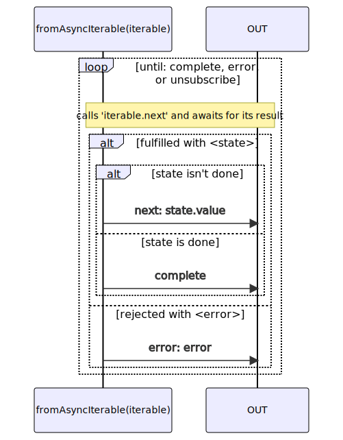

# fromAsyncIterable

### Types

```ts
function fromAsyncIterable<GValue>(
  asyncIterable: AsyncIterable<GValue>,
): IObservable<IFromAsyncIterableObservableNotifications<GValue>>;
```

### Definition

Creates an Observable from an AsyncIterable. It emits values in the form of Notifications.

See [fromAsyncIterator](/docs/reference/from-async-iterator/) for more details.


### Diagram



### Example

#### Simple AsyncIterable which emits values from 0 to 9

```ts
const subscribe = fromAsyncIterable(
  (async function * () {
    for (let i = 0; i < 10; i++) {
      yield i;
    }
  })()
);

subscribe((notification) => {
  console.log(notification.name, ':', notification.value);
});
```

Output:

```text
next: 0
next: 1
...
next: 9
complete
```
