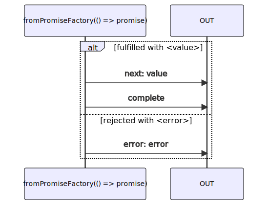

# fromPromiseFactory

### Types

```ts
function fromPromiseFactory<GValue>(
  createPromise: IFromPromiseFactoryCreatePromiseFunction<GValue>,
  options?: IFromPromiseFactoryObservableOptions,
): IObservable<IFromPromiseFactoryObservableNotifications<GValue>>
```

```ts
interface IFromPromiseFactoryObservableOptions {
  signal?: AbortSignal | null;
}

interface IFromPromiseFactoryCreatePromiseFunction<GValue> {
  (signal: AbortSignal): Promise<GValue>;
}
```

### Definition

Creates an Observable from a Promise factory.

The promise factory is a function which receives an AbortSignal and returns a Promise.

The AbortSignal is aborted when the subscription is unsubscribed
(only before the Promise is fulfilled or rejected).
This signal should be used to cancel any pending work (ex: `fetch`, or any pending async task).

The Observable emits values in the form of Notifications:

- `next`: the returned value of the promise
- `complete`: when the promise is fulfilled
- `error`: when the promise is rejected

You may provide a `IObservableFromPromiseFactoryOptions`, which may be used to force an abort from an external AbortSignal.

### Diagram



### Example

#### Simple http request

```ts
const subscribe = fromPromiseFactory((signal: AbortSignal): Promise<Response> => {
  return fetch('https://some-url.site', { signal });
});

subscribe((notification) => {
  console.log(notification.name, ':', notification.value);
});
```

Output:

*if fulfilled*

```text
next: Response
complete
```

*if rejected*

```text
error: Error
```
