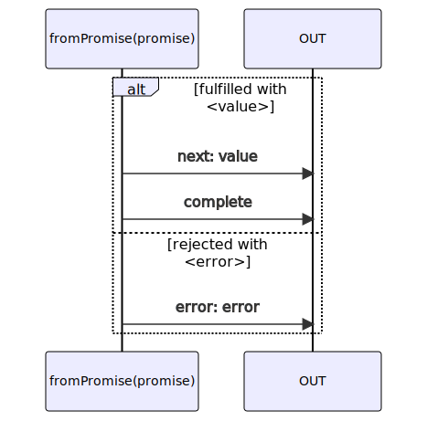

# fromPromise

### Types

```ts
function fromPromise<GValue>(
  promise: Promise<GValue>,
): IObservable<IFromPromiseObservableNotifications<GValue>>
```

### Definition

Creates an Observable from a Promise.

The Observable emits values in the form of Notifications:

- `next`: the returned value of the promise
- `complete`: when the promise is fulfilled
- `error`: when the promise is rejected

:::caution

`fromPromise` should be used only if you already have a Promise, else you should prefer to
use [fromPromiseFactory](/docs/reference/from-promise-factory/) which provides an AbortSignal to properly
cancel any pending tasks.

:::


### Diagram



### Examples

#### Fulfilled Promise

```ts
const subscribe = fromPromise(Promise.resolve('Hello World !'));

subscribe((notification) => {
  console.log(notification.name, ':', notification.value);
});
```

Output:

```text
next: Hello World !
complete
```

#### Rejected Promise

```ts
const subscribe = fromPromise(Promise.reject(new Error('Rejected')));

subscribe((notification) => {
  console.log(notification.name, ':', notification.value);
});
```

Output:

```text
error: Error('Rejected')
```
