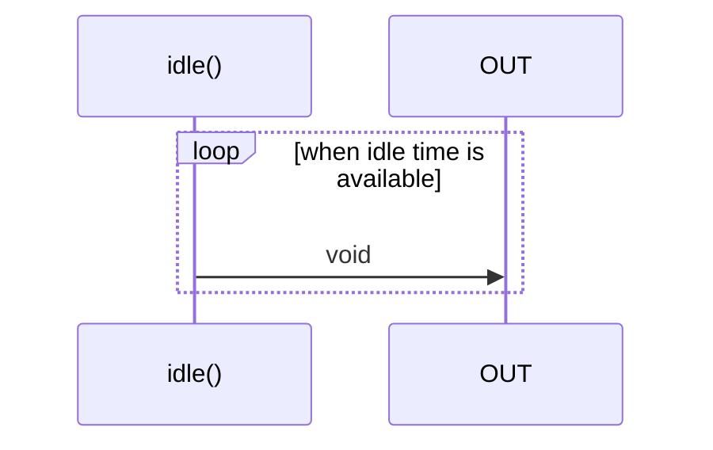

# idle

### Types

```ts
function idle(
  options?: IdleRequestOptions,
): IObservable<IdleDeadline>
```

### Definition

Creates an Observable that emits when idle time is available.

### Diagram



### Example

#### Recurring 'ping'

```ts
const subscribe = idle();

const unsubscribe = subscribe(() => {
  console.log('ping');
});
```

Output:

```text
ping
ping
ping
ping
...
```

