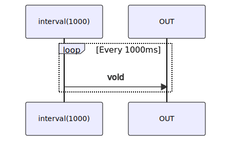

# interval

### Types

```ts
function interval(
  period: number,
): IObservable<void>
```

### Definition

Creates an Observable that emits "void" every specified interval of time.

### Diagram



### Example

#### Recurring 'ping'

```ts
const subscribe = interval(1000);

const unsubscribe = subscribe((notification) => {
  console.log('ping');
});

setTimeout(4500, unsubscribe);
```

Output:

```text
ping
ping
ping
ping
```
