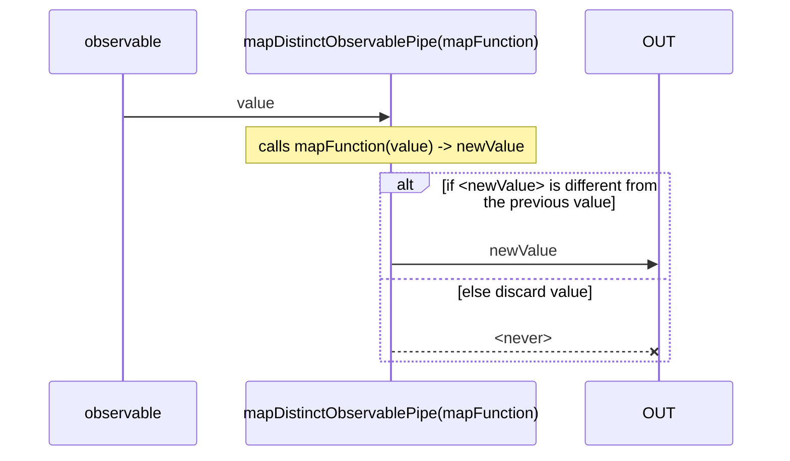
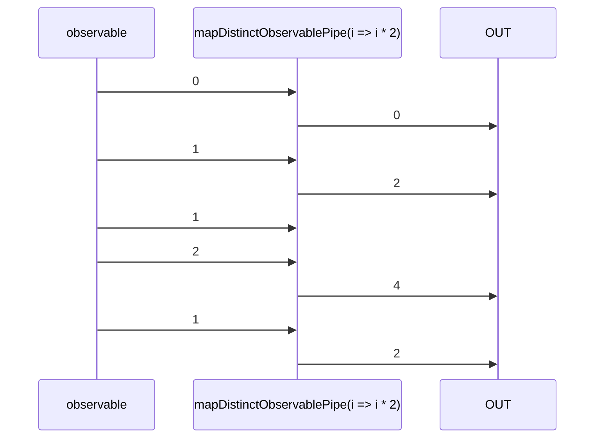

# mapDistinctObservable

Alternative: `mapDistinct$$$`

Inlined: `mapDistinctObservable`, `mapDistinct$$`

### Types

```ts
function mapDistinctObservablePipe<GIn, GOut>(
  mapFunction: IMapFunction<GIn, GOut>,
  options?: IDistinctOptions<GValue>,
): IObservablePipe<GIn, GOut>
```

See [distinctObservablePipe](/docs/reference/distinct-observable-pipe/) for the `options`.

### Definition

Applies a given `mapFunction` function to each value emitted by the source Observable, and emits the resulting values that are distinct by comparison from the last previous value.

The equivalent is:

```ts
pipe([
  mapObservablePipe(mapFunction),
  distinctObservablePipe(options),
])
```

### Diagram

#### Algorithm



#### Example



### Example

#### Emit only distinct values

```ts
const subscribe = pipe$$(of(0, 1, 1, 2, 1), [
  mapDistinct$$(i => i * 2),
]);

subscribe((value) => {
  console.log(value);
});
```

Output:

```text
0
2
4
2
```
