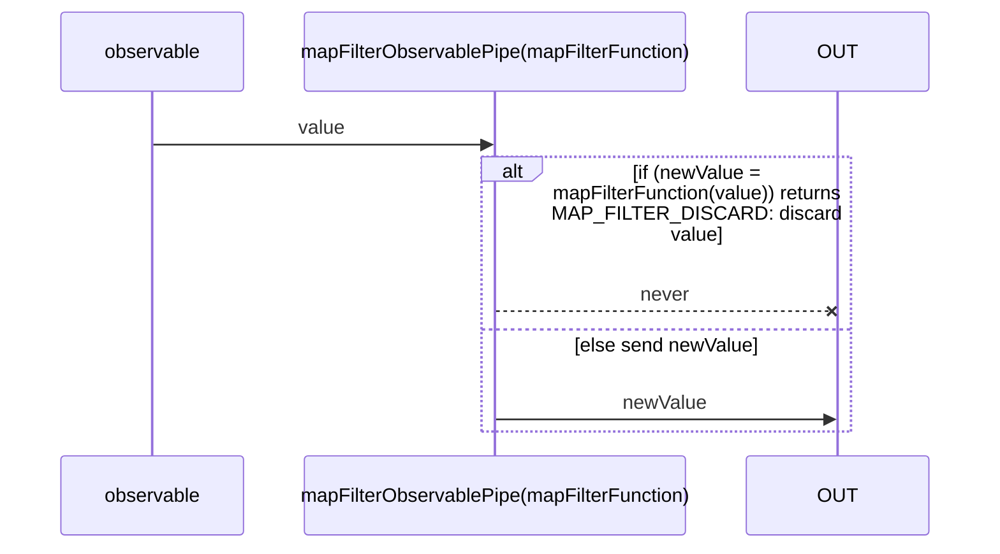
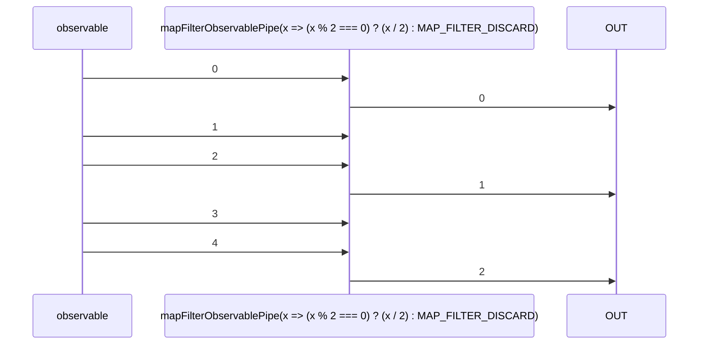

# mapFilterObservablePipe

Alternative: `mapFilter$$$`

Inlined: `mapFilterObservable`, `mapFilter$$`

### Types

```ts
function mapFilterObservablePipe<GIn, GOut>(
  mapFunction: IMapFilterMapFunction<GIn, GOut>,
): IObservablePipe<GIn, GOut>
```

### Definition

Applies a given `mapFunction` function to each value emitted by the source Observable, and emits the resulting values as an Observable if `MAP_FILTER_DISCARD` is not returned.

### Diagram

#### Algorithm



#### Example



### Example

#### Emits only the even values, and divide them by 2

```ts
const subscribe = pipe$$(of(0, 1, 2, 3, 4), [
  mapFilter$$$(x => {
    return (x % 2 === 0) // even
      ? x / 2
      : MAP_FILTER_DISCARD;
  }),
]);

subscribe((value) => {
  console.log(value);
});
```

Output:

```text
0
1
2
```
