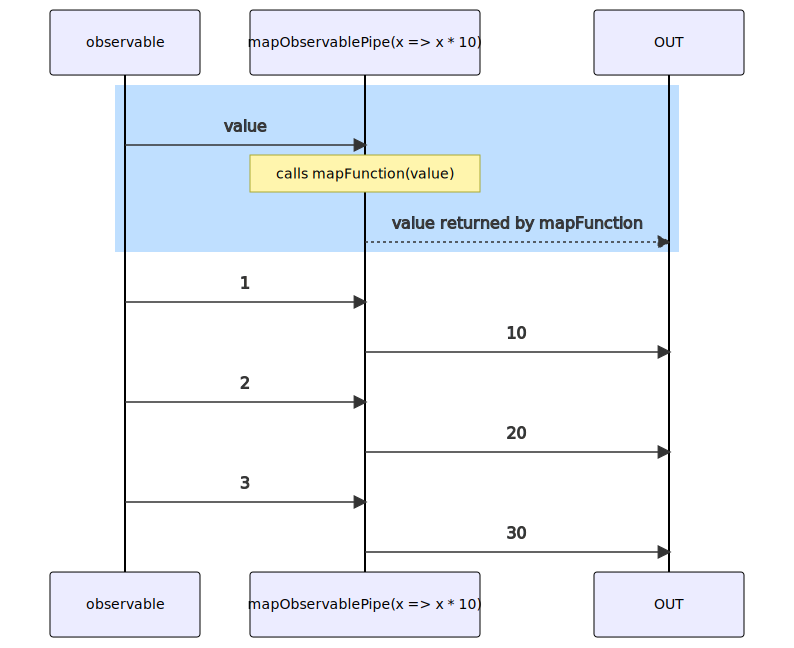

# mapObservablePipe

Alternative: `map$$$`

Inlined: `mapObservable`, `map$$`

### Types

```ts
function mapObservablePipe<GIn, GOut>(
  mapFunction: IMapFunction<GIn, GOut>,
): IObservablePipe<GIn, GOut>
```

### Definition

Applies a given `mapFunction` function to each value emitted by the source Observable, and emits the resulting values as an Observable.

The RxJS equivalent is [map](https://rxjs-dev.firebaseapp.com/api/operators/map).

### Diagram



### Example

#### Multiply incoming values by 10

```ts
const subscribe = pipe$$(of(1, 2, 3), [
  map$$$(x => x * 10),
]);

subscribe((value) => {
  console.log(value);
});
```

Output:

```text
10
20
30
```

