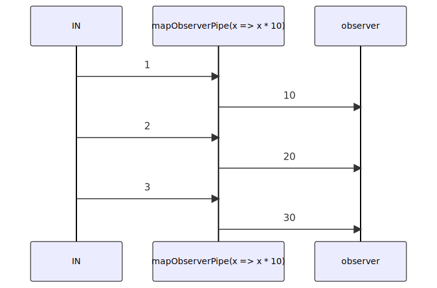

# mapObserverPipe

Alternative: `$$$map`

Inlined: `mapObserver`, `$$map`

### Types

```ts
function mapObserverPipe<GIn, GOut>(
  mapFunction: IMapFunction<GIn, GOut>,
): IObserverPipe<GIn, GOut>
```

### Definition

Applies a given `mapFunction` function to each value sent to the returned Observer, and emits the result to the destination Observer.

### Diagram



### Example

#### Add a 'date' information on the incoming messages

```ts
const emit = $$map($log, (message: string): string => {
  return `[${new Date().toISOString()}] ${message}`;
});

emit('Hello World !');
```

Output:

```text
[2022-10-25T13:04:02.891Z] Hello World !
```

