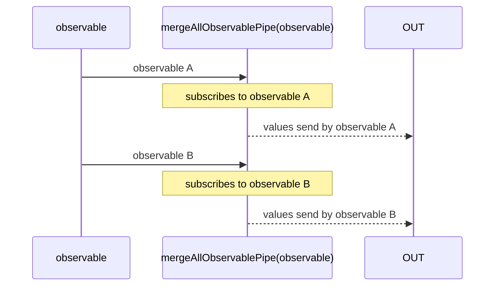

# mergeAllObservablePipe

Alternative: `mergeAll$$$`

Inlined: `mergeAllObservable`, `mergeAll$$`

### Types

```ts
function mergeAllObservablePipe<GValue>(
  maxNumberOfSubscriptions: number = Number.POSITIVE_INFINITY,
): IObservablePipe<IObservable<GValue>, GValue>
```

### Definition

This function subscribes to an *Observable* that emits some *Observables*, also known as an
*HigherOrderObservable*.

Each time it observes one of these emitted inner *Observable*, it subscribes to that and delivers all the values from the inner *Observable*
on the output *Observable*.

You may provide a `maxNumberOfSubscriptions` which limits the maximum number of subscriptions.
If reached, it unsubscribes the least recent ones.

The RxJS equivalent is [mergeAll](https://rxjs-dev.firebaseapp.com/api/operators/mergeAll).

### Diagram



### Example

#### Reduce the order of Observables with random values

```ts
const subscribe = pipe$$(interval(1000), [
  map$$$(() => single(Math.random())),
  mergeAll$$$(1),
]);

subscribe((value) => {
  console.log(value);
});
```

Output:

```text
0.04631441789007029
0.05798639920106741
...
```
