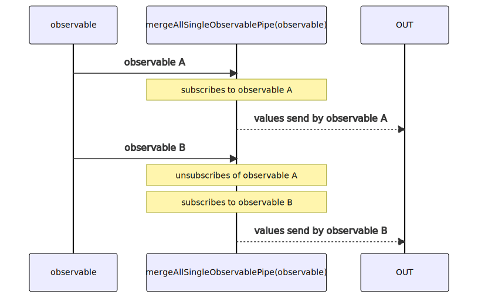

# mergeAllSingleObservablePipe

Alternatives: `mergeAllS$$$`, `switchAllObservable`, `switchAll$$$`

Inlined: `mergeAllSingleObservable`, `mergeAllSingle$$`, `mergeAllS$$`, `switchAllObservable`, `switchAll$$`

### Types

```ts
function mergeAllSingleObservablePipe<GValue>(): IObservablePipe<IObservable<GValue>, GValue>
```

### Definition

This function is a shortcut and optimized version of `mergeAllObservablePipe(1)`

See [mergeAllObservablePipe](/docs/reference/merge-all-observable-pipe/).

The RxJS equivalent is [switchAll](https://rxjs.dev/api/index/function/switchAll).

### Diagram


