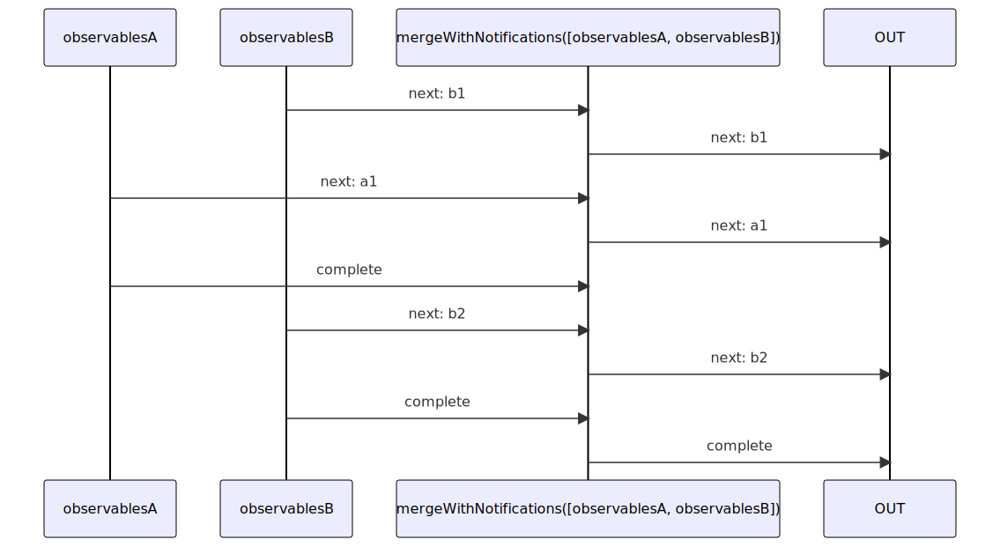
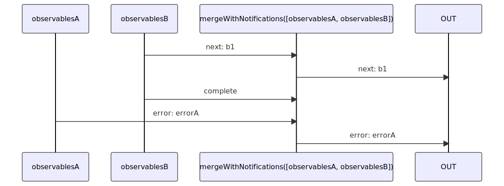

# mergeWithNotifications

Alternatives: `mergeN`

### Types

```ts
function mergeWithNotifications<GObservables extends IGenericMergeWithNotificationsInObservables>(
  observables: GObservables,
): IObservable<IMergeWithNotificationsObservableNotifications<GObservables>>
```

### Definition

Emits all the `next` Notifications from all the provided Observables as `next` Notifications too.

When all the provided Observables have sent a `complete` Notification, the Observable ends and sends a `complete` Notification.

If one of the provided Observables sends an `error` Notification, the returned Observable ends and sends this `error` Notification.


### Diagrams

#### If all completed



#### If one errored



### Example

#### Example 1

```ts
const observable1$ = ofN(0, 1);
const observable2$ = switchMap$$(timeout(2000), () => ofN(2, 3));

const result$ = mergeWithNotifications([observable1$, observable2$]);

result$((notification) => {
  console.log(notification.name, notification.value);
});

```

Output:

```text
// t = 0
'next', 0
'next', 1
// t = 2000ms
'next', 2
'next', 3
'complete', undefined
```
