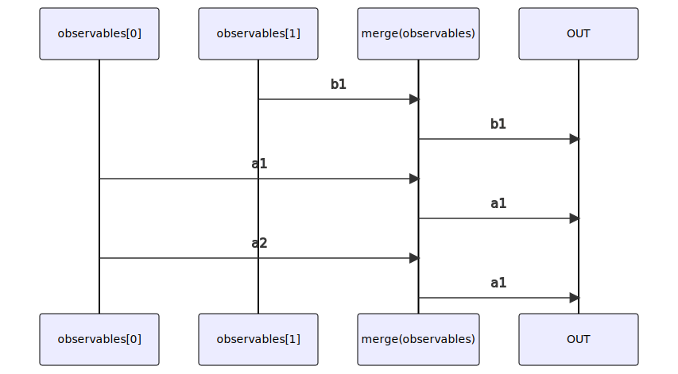

# merge

### Types

```ts
function merge<GObservables extends readonly IGenericObservable[]>(
  observables: GObservables,
): IObservable<IMergeObservablesValues<GObservables>>
```

### Definition

Creates an output Observable which concurrently emits all values from every given input Observable.

The RxJS equivalent is [merge](https://rxjs.dev/api/index/function/merge).

### Diagram



### Example

#### Simple merge of 2 Observables

```ts
// observable generating 0, 1, 2, 3,... every 500ms
const obs1 = pipe$$(interval(500), [
  scan$$$<void, number>((i) => (i + 1), 0),
]);

// observable generating 'a', 'b', 'c',... every 550ms
const obs2 = pipe$$(interval(550), [
  scan$$$<void, number>((i) => (i + 1), 97),
  map$$$<void, string>(String.fromCharCode),
]);

// highlight-next-line
const subscribe = merge([obs1, obs2]);

let startTime: number = Date.now();
subscribe((result) => {
  console.log(`${ (Date.now() - startTime).toString(10) }ms`, result);
})
```

Output:

```text
500ms: 0
550ms: 'a'
1000ms: 1
1100ms: 'b'
1500ms: 2
1650ms: 'c'
...
```
