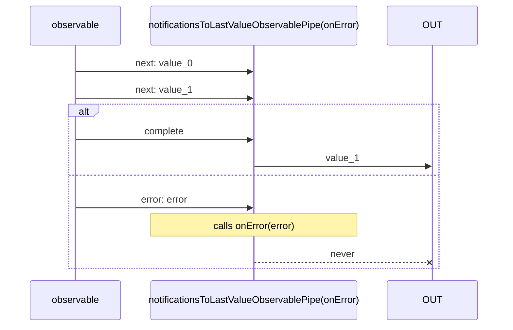

# notificationsToLastValueObservablePipe

Alternative: `notificationsToLastValue$$$`

Inlined: `notificationsToValuesObservable`, `notificationsToValues$$`


### Types

```ts
function notificationsToLastValueObservablePipe<GValue>(
  onError?: INotificationsToLastValueObservableOnErrorFunction,
): IObservablePipe<IDefaultInNotificationsUnion<GValue>, GValue>
```

### Definition

Stores the last value received through a `next` *Notifications*, then when a `complete` is received,
it emits this value.

You may provide:

- `onError`: called when an `error` *Notification* is received. In this case the Observable never emits.


### Diagram



### Example

#### Converts an observable of notifications to a simple Observable

```ts
const subscribe = pipe$$(fromArrayWithNotifications([1, 2, 3, 4]), [
  notificationsToLastValue$$$<number>(),
]);

subscribe((value: number) => {
  console.log(value);
});
```

Output:

```text
4
```
