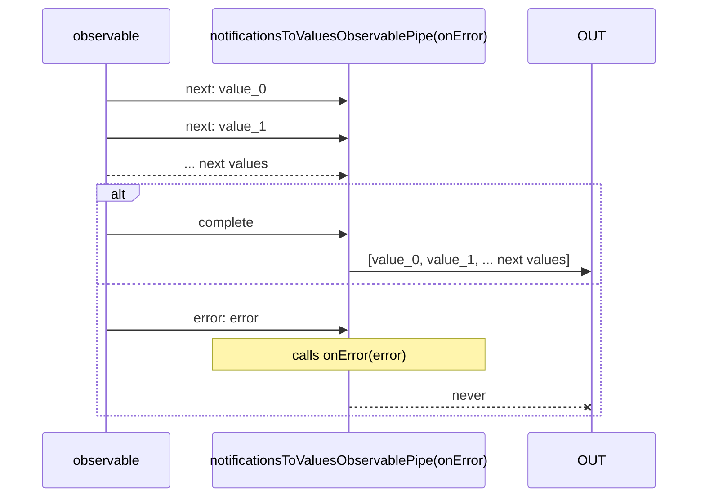

# notificationsToValuesObservablePipe

Alternative: `notificationsToValues$$$`

Inlined: `notificationsToValuesObservable`, `notificationsToValues$$`


### Types

```ts
function notificationsToValuesObservablePipe<GValue>(
  onError?: INotificationsToValuesObservableOnErrorFunction,
  maxNumberOfValues?: number,
): IObservablePipe<IDefaultInNotificationsUnion<GValue>, GValue[]>
```

### Definition

Accumulates all values emitted using `next` *Notifications*, until `complete` is received.
Then emit these values as an array.

You may provide:

- `onError`: called when an `error` *Notification* is received. In this case the Observable never emits.
- `maxNumberOfValues`: maximal size of the array containing the values (retains `maxNumberOfValues` last values).


### Diagram



### Example

#### Converts an observable of notifications to a simple Observable

```ts
const subscribe = pipe$$(fromArrayWithNotifications([1, 2, 3, 4]), [
  notificationsToValues$$$<number>(),
]);

subscribe((values: number[]) => {
  console.log(values);
});
```

Output:

```text
[1, 2, 3, 4]
```
