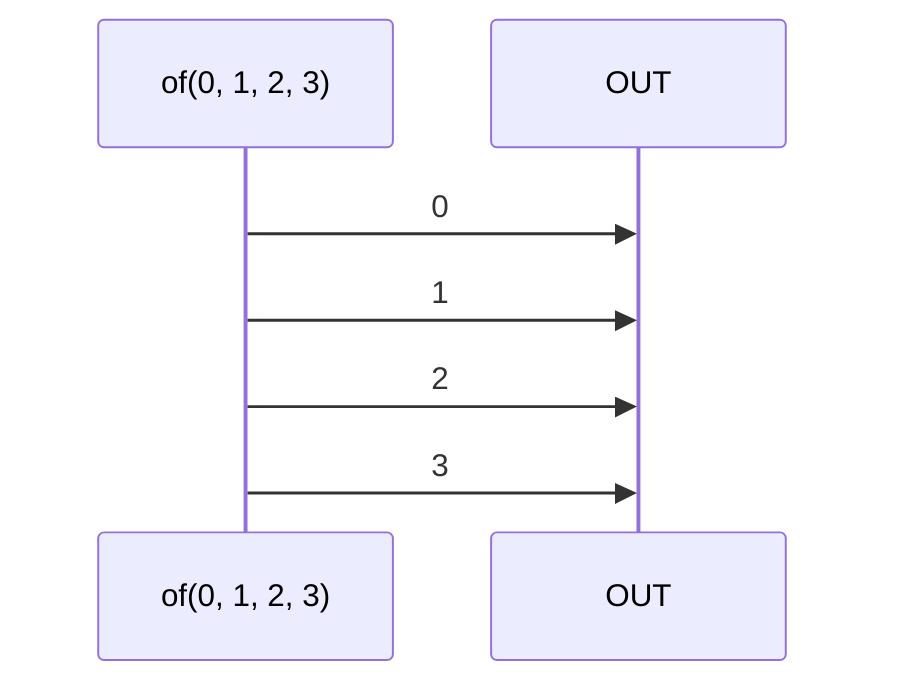

# of

### Types

```ts
function of<GValue>(
  ...values: GValue[]
): IObservable<GValue>
```

### Definition

Creates an Observable from a list of values. It emits the values sequentially one by one.

This is the spread equivalent of [fromArray](/docs/reference/from-array/).

### Diagram



### Example

#### Emit the values 0, 1, 2, 3

```ts
const subscribe = of(0, 1, 2, 3);

subscribe((value: number) => {
  console.log(value);
});
```

Output:

```text
0
1
2
3
```


