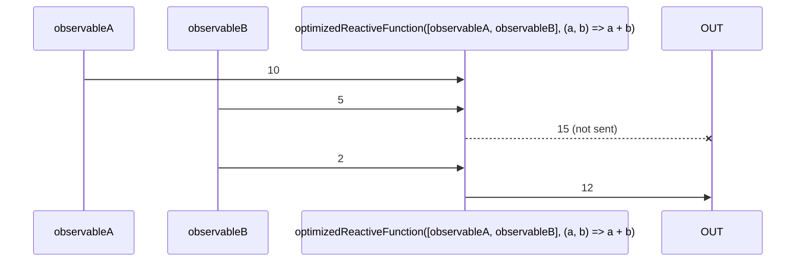

# optimizedReactiveFunction

Alternative: `function$$`

### Types

```ts
function optimizedReactiveFunction<GFunction extends IGenericFunction>(
  observables: IReactiveFunctionObservables<GFunction>,
  fnc: GFunction,
): IReactiveFunctionReturn<GFunction>
```

### Definition

Most of the time, when using [reactiveFunction](/docs/reference/reactive-function/), you'll usually update its observable in batch,
and would prefer to have a `reactiveFunction` that emit only once and only if the value changed.
This is the purpose of `optimizedReactiveFunction`.

It simply does:

```ts
return distinctObservable(debounceMicrotaskObservable(reactiveFunction<GFunction>(observables, fnc)));
```

### Diagram



### Example

#### Perform the "sum" of two Observables in batch

```ts
const [$value1, value1$] = let$$<number>(0);
const [$value2, value2$] = let$$<number>(0);

const subscribe = optimizedReactiveFunction(
  [value1$, value2$],
  (a: number, b: number) => {
    return a + b;
  },
);

subscribe((sum: number) => {
  console.log(sum);
});
$value1(2);
$value2(1);
```

Output:

```text
3
```

:::info

As you may see, the values are debounced, ensuring a single value instead of many.

:::

