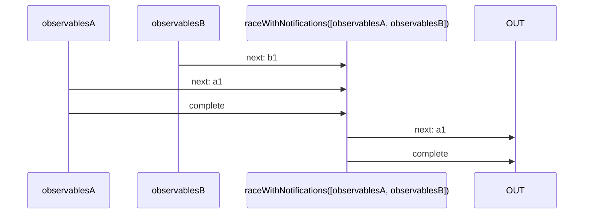
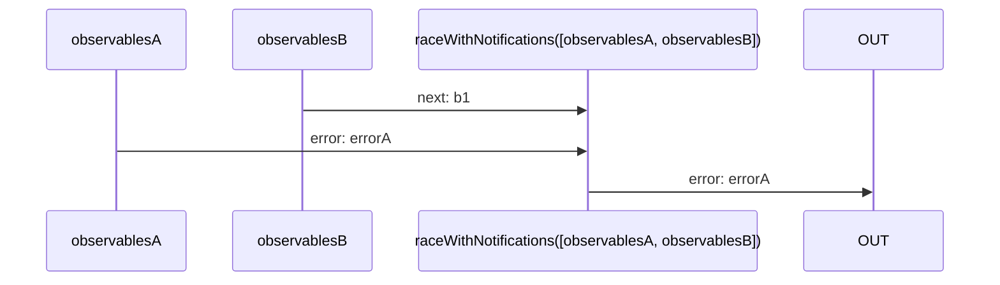

# raceWithNotifications

Alternative: `raceN`

### Types

```ts
function raceWithNotifications<GObservables extends IGenericRaceInObservables>(
  observables: GObservables,
): IObservable<IRaceObservableNotifications<GObservables>>
```

### Definition

Waits for the first observable to send a `complete` or `error` Notification.

If it received a `complete` Notification, it will emit the last value received through the `next` Notifications of this observable,
followed by a `complete` Notification.

If it received an `error` Notification, it will immediately send this Notification (`error`).

This is equivalent of `Promise.race`.

### Diagrams

#### If one completes



#### If one errored



### Example

#### Select the first Observable to complete

```ts
const observable1$ = switchMap$$(timeout(500), () => singleN<'a1'>('a1'));
const observable2$ = switchMap$$(timeout(1000), () => singleN<'a2'>('a2'));

const subscribe = raceWithNotifications([observable1$, observable2$]);

subscribe((value: IDefaultNotificationsUnion<'a1' | 'a2'>) => {
  console.log(value);
});
```

Output:

```text
// t = 500ms
'next', 'a1'
'complete', undefined
```
