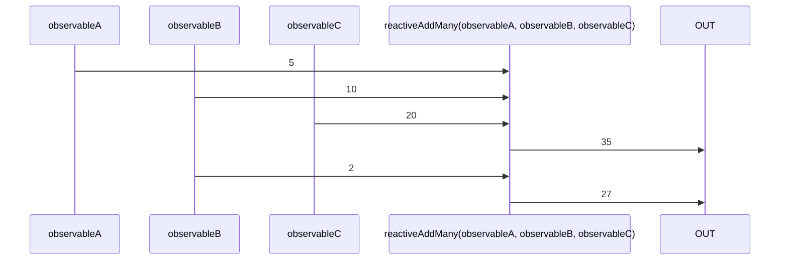

# reactiveAddMany

Alternatives: `addMany$$`, `addM$$`, `sum$$`

### Types

```ts
function reactiveAddMany(
 ...observables: IObservable<number>[]
): IObservable<number>
```

### Definition

Creates an Observable which performs an addition (`+`) between the values sent by many Observables, and emits the result.

### Diagram



### Example

#### Perform the "sum" of three Observables

```ts
const subscribe = reactiveAddMany(
  single(10),
  single(20),
  single(5),
);

subscribe((value: number) => {
  console.log(value);
});
```

Output:

```text
35
```
