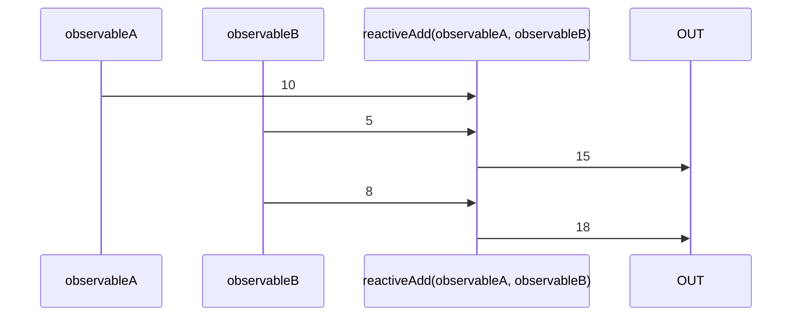

# reactiveAdd

Alternative: `add$$`

### Types

```ts
function reactiveAdd(
  a: IObservable<number>,
  b: IObservable<number>,
): IObservable<number>
```

### Definition

Creates an Observable which performs an addition (`+`) between the values sent by two Observables, and emits the result.

### Diagram



### Example

#### Perform the "addition" of two Observables

```ts
const subscribe = reactiveAdd(
  single(10),
  single(5),
);

subscribe((value: number) => {
  console.log(value);
});
```

Output:

```text
15
```
