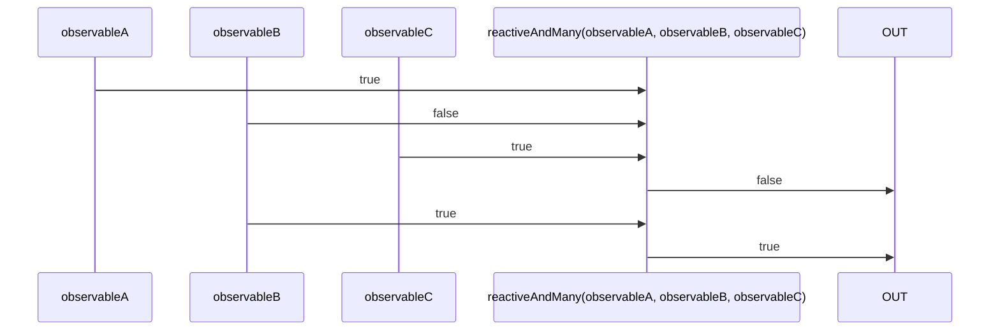

# reactiveAndMany

Alternatives: `andMany$$`, `andM$$`

### Types

```ts
function reactiveAndMany(
  ...observables: IObservable<boolean>[]
): IObservable<boolean>
```

### Definition

Creates an Observable which performs the boolean `AND` operation (`&&`) between the values sent by many Observables, and emits the result.

### Diagram



### Example

#### Perform the boolean "AND" of three Observables

```ts
const subscribe = reactiveAndMany(
  single(true),
  single(false),
  single(true),
);

subscribe((value: boolean) => {
  console.log(value);
});
```

Output:

```text
false
```
