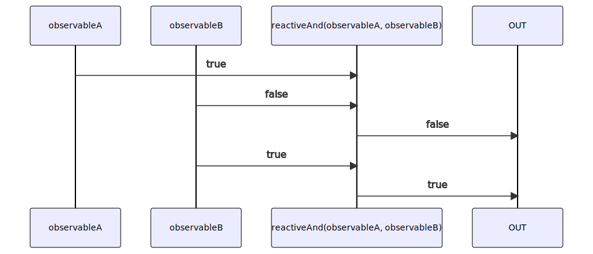

# reactiveAnd

Alternative: `and$$`

### Types

```ts
function reactiveAnd(
  a: IObservable<boolean>,
  b: IObservable<boolean>,
): IObservable<boolean>
```

### Definition

Creates an Observable which performs the boolean `AND` operation (`&&`) between the values sent by two Observables, and emits the result.

### Diagram



### Example

#### Perform the boolean "AND" of two Observables

```ts
const subscribe = reactiveAnd(
  single(true),
  single(false),
);

subscribe((value: boolean) => {
  console.log(value);
});
```

Output:

```text
false
```
