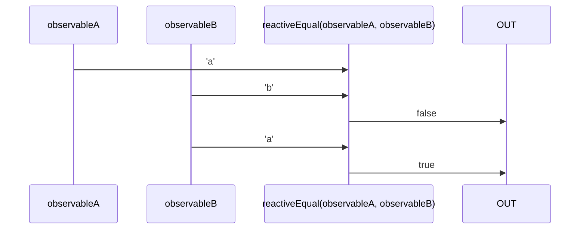

# reactiveEqual

Alternatives: `equal$$`, `eq$$`

### Types

```ts
function reactiveEqual(
  a: IObservable<any>,
  b: IObservable<any>,
): IObservable<boolean>
```

### Definition

Creates an Observable which performs a strict equal comparison (`===`) between the values sent by two Observables, and emits the result.

### Diagram



### Example

#### Perform a strict equal comparison of two Observables

```ts
const subscribe = reactiveEqual(
  single('a'),
  single('b'),
);

subscribe((value: boolean) => {
  console.log(value);
});
```

Output:

```text
false
```
