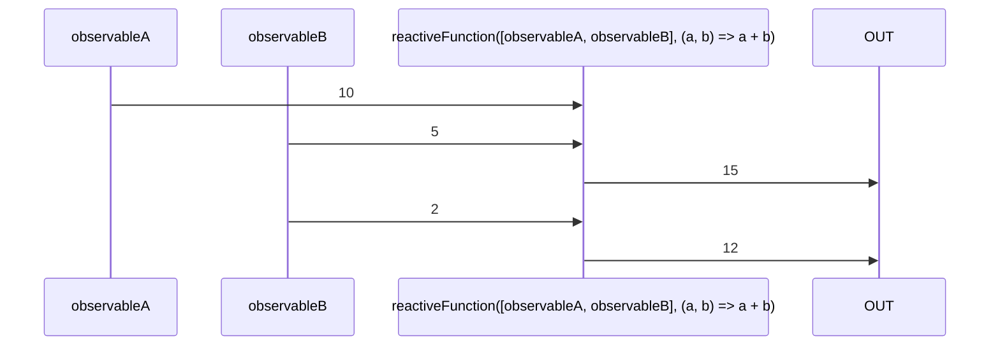

# reactiveFunction

Alternative: `functionI$$`

### Types

```ts
function reactiveFunction<GFunction extends IGenericFunction>(
  observables: IReactiveFunctionObservables<GFunction>,
  fnc: GFunction,
): IReactiveFunctionReturn<GFunction>
```

### Definition

Creates an output Observable which aggregates the values from all the Observables passed as arguments.
When an Observable changes, the function is called, and the return is emitted.

It simply does:

```ts
pipe$$(combineLatest<GObservables>(observables), [
  map$$$<GCombineLastObservables, GOut>((args: GCombineLastObservables) => fnc(...(args as any))),
]);
```

`@lirx/core` comes with some common predefined [reactiveFunctions](/docs/tags/reactive-function/).


If you prefer to have a function which handles changes in batch you may want to use:
[optimizedReactiveFunction](/docs/reference/optimized-reactive-function/).

### Diagram



### Example

#### Perform the "sum" of two Observables

```ts
const [$value1, value1$] = let$$<number>(0);
const [$value2, value2$] = let$$<number>(0);


const subscribe = reactiveFunction(
  [value1$, value2$],
  (a: number, b: number) => {
    return a + b;
  },
);

subscribe((sum: number) => {
  console.log(sum);
});
// => 0
$value1(2); // => 2
$value2(1); // => 3
```

Output:

```text
0
2
3
```

---

:::caution

You should avoid using a lot of ReactiveFunctions when you could just create one.

:::

If you want to achieve

```text
((obs1 + obs2) * obs3) === obs4
```

Avoid

```ts
eq$$(mul$$(add$$(obs1, obs2), obs3), obs4);
```

And prefer

```ts
reactiveFunction(
  [obs1, obs2, obs3, obs4],
  (obs1, obs2, obs3, obs4) => {
    return ((obs1 + ob2) * obs3) === obs4;
  },
);
```
