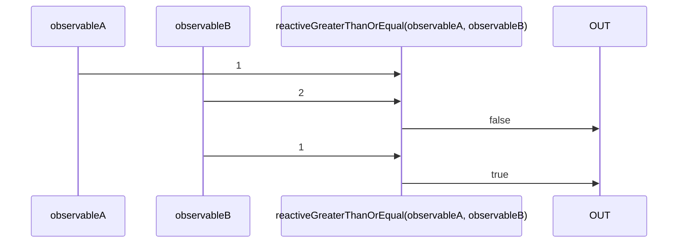

# reactiveGreaterThanOrEqual

Alternatives: `greaterThanOrEqual$$`, `gte$$`

### Types

```ts
function reactiveGreaterThanOrEqual(
  a: IObservable<any>,
  b: IObservable<any>,
): IObservable<boolean>
```

### Definition

Creates an Observable which performs a greater than or equal comparison (`>=`) between the values sent by two Observables, and emits the result.

### Diagram



### Example

#### Perform a greater than comparison of two Observables

```ts
const subscribe = reactiveGreaterThanOrEqual(
  single(2),
  single(1),
);

subscribe((value: boolean) => {
  console.log(value);
});
```

Output:

```text
true
```
