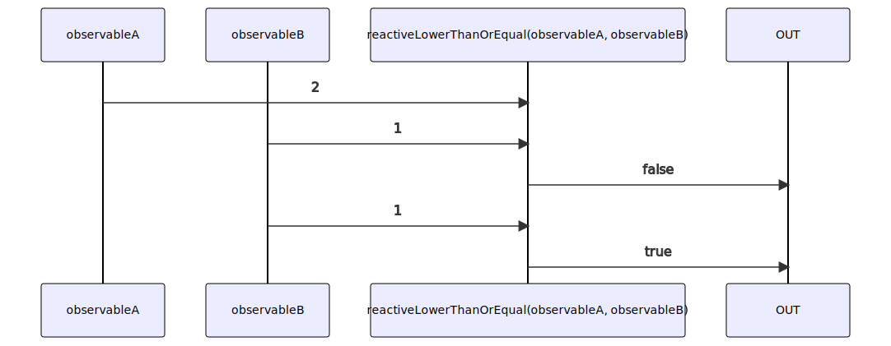

# reactiveLowerThanOrEqual

Alternatives: `lowerThanOrEqual$$`, `lte$$`

### Types

```ts
function reactiveLowerThanOrEqual(
  a: IObservable<any>,
  b: IObservable<any>,
): IObservable<boolean>
```

### Definition

Creates an Observable which performs a lower than or equal comparison (`>=`) between the values sent by two Observables, and emits the result.

### Diagram



### Example

#### Perform a lower than comparison of two Observables

```ts
const subscribe = reactiveLowerThanOrEqual(
  single(1),
  single(2),
);

subscribe((value: boolean) => {
  console.log(value);
});
```

Output:

```text
true
```
