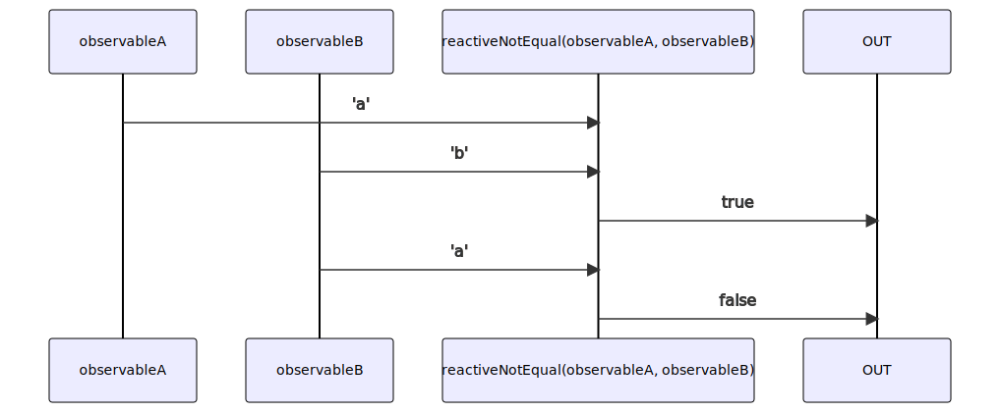

# reactiveNotEqual

Alternatives: `notEqual$$`, `neq$$`

### Types

```ts
function reactiveNotEqual(
  a: IObservable<any>,
  b: IObservable<any>,
): IObservable<boolean>
```

### Definition

Creates an Observable which performs a strict not equal comparison (`!==`) between the values sent by two Observables, and emits the result.

### Diagram



### Example

#### Perform a strict not equal comparison of two Observables

```ts
const subscribe = reactiveNotEqual(
  single('a'),
  single('b'),
);

subscribe((value: boolean) => {
  console.log(value);
});
```

Output:

```text
true
```
